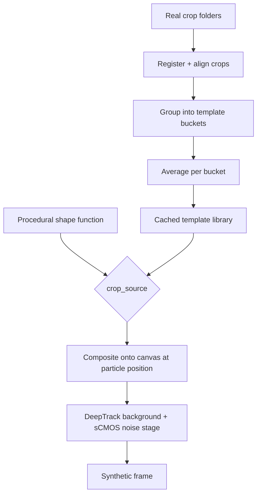

# Crop-Based Particle Rendering

## Summary

Add a crop-based rendering path to `verification/render.py`'s DeepTrack strategy: particle
appearance comes from a small library of empirically-averaged real crop templates, or from a
procedural shape generator, instead of solely a physics-simulated diffraction kernel —
composited onto the canvas and run through the existing background/sCMOS noise stage unchanged.

## Problem Frame

`verification/render.py` currently supports three render strategies (`procedural`, `deeptrack`,
`randomized`), all of which synthesize particle appearance from parametric models — a flat
Gaussian, or DeepTrack2's physics-simulated diffraction PSF. These models are internally
consistent but idealized: every particle looks like a mathematically perfect point-spread
function, with variation introduced only through log-normal intensity sampling and additive
noise. Real 2 µm PS particles imaged under epi-fluorescence show more per-particle variation —
shape asymmetry, texture, occasional aggregates — that no closed-form PSF captures no matter how
well its parameters are fit.

Because `verification/benchmark.py` measures detector and tracker accuracy against these
synthetic frames, a systematic mismatch between synthetic and real particle appearance risks
making benchmark numbers a poor proxy for real-world performance. This gap hasn't been directly
measured yet — no benchmark run has compared real-frame accuracy against synthetic-frame
accuracy for the same model — so the motivation here is a suspected rather than confirmed gap.

---

## Key Decisions

- **Empirical-kernel averaging over raw crop stamping.** Averaging real crops into templates
  cancels out each crop's own independent photon/read noise before the DeepTrack noise stage
  adds noise back. Stamping raw real crops directly would double-count degradation, since real
  crops already carry their own camera noise from the original exposure. Diversity is retained
  via multiple templates rather than one universal average.
- **Reuse existing crop libraries rather than curating new ones.**
  `data-setup/models/lodestar_model_15/crops/` and similar LodeSTAR crop folders become the
  initial source for real templates — no new crop-collection tooling in this iteration. Revisit
  if templates prove contaminated by partial or multi-particle crops.
- **Calibration is a pre-flight check, not a blocker.** `verification/calibrate_psf.py` has not
  yet been run against real frames to merge fitted PSF/background/noise parameters into
  `config.yaml`. This work proceeds regardless of that outcome, since even a well-calibrated
  parametric PSF can't reproduce per-particle irregularity — but running calibration first is a
  fast, low-cost sanity check worth doing before or alongside this work.
- **Scoped to benchmark rendering, not training data.** This targets `verification/render.py`'s
  synthetic frames used for detector/tracker benchmarking, not the `data-setup/` auto-labeling
  pipeline that produces RF-DETR/YOLOv12 training data.

---

## Requirements

**Rendering mechanism**

- R1. `verification/render.py`'s DeepTrack strategy gains a configurable `crop_source`
  (`physics` | `real` | `procedural`) that determines how the clean per-particle appearance is
  produced, alongside the current physics-simulated kernel.
- R2. When `crop_source: real`, the renderer builds a small library of empirical PSF templates
  by registering and averaging multiple real particle crops drawn from existing crop folders
  (e.g. `data-setup/models/lodestar_model_15/crops/`), rather than compositing raw individual
  crops.
- R3. When `crop_source: procedural`, the renderer generates the clean particle appearance from
  a parametric mathematical shape function instead of real crop data.
- R4. Both crop sources plug into the same render-kernel-then-stamp convolution path
  `render_deeptrack.py` already uses for its physics-simulated kernel — the DeepTrack background
  heterogeneity and sCMOS noise stage runs unchanged on top of either.
- R5. Particle positions in the rendered frame remain pixel-accurate against `ground_truth.json`
  / `ground_truth_tracks.csv`, matching the contract the existing procedural/deeptrack/randomized
  strategies already satisfy.

**Diversity and template management**

- R6. The empirical template library supports more than one template (e.g. distinguishing
  typical particles from aggregates or tilted ones) so per-particle appearance isn't flattened
  to a single universal average.
- R7. Template selection per particle is randomized per frame/particle rather than fixed, to
  avoid visually repetitive output across a rendered sequence.

**Validation**

- R8. `verification/compare_renders.py`'s existing realism metrics (SNR, radial PSD similarity)
  extend to cover the new crop-based strategy, using the same real-frame comparison workflow
  already in place for procedural/deeptrack/randomized.
- R9. The real frame(s) used for realism comparison in R8 are drawn from different source
  footage than the real crops used to build the empirical template library (R2), to avoid the
  comparison measuring memorization instead of generalization.

---

## Key Flows

- F1. Empirical template build (one-time / cached)
  - **Trigger:** First render with `crop_source: real`, or an explicit build step.
  - **Steps:** Real crops loaded from the configured crop folder → registered/aligned → grouped
    into template buckets → averaged per bucket → normalized templates cached for reuse across
    frames.
  - **Outcome:** A small template library ready for per-particle sampling, avoiding repeated
    recomputation per frame.
  - **Covered by:** R2, R6.

- F2. Per-frame particle rendering
  - **Trigger:** `render.py` renders a LAMMPS timestep.
  - **Steps:** For each particle position, a template (real or procedural) is sampled per R7 →
    convolved/composited onto the canvas at the particle's pixel position → DeepTrack background
    heterogeneity and sCMOS noise stage applied to the full canvas, unchanged from today.
  - **Outcome:** A synthetic frame with real/procedural particle appearance and the existing
    noise model, at the same ground-truth-position accuracy as other strategies.
  - **Covered by:** R1, R4, R5, R7.

---

## Acceptance Examples

- AE1. **Covers R1, R2.**
  - **Given** `render_strategy: deeptrack` and `crop_source: real` in `config.yaml`
  - **When** `render.py` renders a frame
  - **Then** each particle's clean appearance comes from a randomly selected empirical template
    built from averaged real crops, convolved onto the canvas, with DeepTrack's background/noise
    stage applied on top — ground truth positions unaffected.

- AE2. **Covers R1, R3.**
  - **Given** `render_strategy: deeptrack` and `crop_source: procedural` in `config.yaml`
  - **When** `render.py` renders a frame
  - **Then** each particle's clean appearance comes from the procedural shape function instead
    of any real crop data, with the same noise stage applied on top.

---

## Scope Boundaries

**Deferred for later**

- Physics-core + real-residual-texture approach — keep DeepTrack's diffraction convolution as
  the base shape and add a real-crop-derived residual texture on top. A lower-risk-to-value
  alternative worth prototyping if the empirical-kernel approach doesn't close the realism gap
  enough once measured.

**Outside this iteration**

- Changes to the `data-setup/` auto-labeling pipeline or RF-DETR/YOLOv12 training data
  generation — this work is scoped to `verification/`'s benchmark rendering only.
- New crop curation tooling — reuses `crop_tool.py`'s existing crop folders as-is.
- Directly measuring the sim-to-real gap prior to this work landing — R8/R9 (realism comparison)
  is how the gap gets measured, not a precondition for starting.

---

## Dependencies / Assumptions

- Depends on `verification/render_deeptrack.py`'s existing render-kernel-then-stamp convolution
  machinery and `verification/calibrate_psf.py`'s spot-detection/Gaussian-fit code as the basis
  for extracting and registering real crops into templates.
- Depends on existing real crop folders (e.g. `data-setup/models/lodestar_model_15/crops/`,
  `data-setup/models/lodestar_model_10/crops/`) containing enough usable single-particle crops
  to build a representative template library.
- Assumes those crop folders' source footage differs from whatever real frame(s) get used in
  `compare_renders.py` for the R9 realism check; if they overlap, a different held-out real
  video is needed for validation.
- Assumes a sim-to-real gap exists in current benchmark numbers, though this is unconfirmed —
  running `calibrate_psf.py` against real frames first is a cheap way to sanity-check the
  physics-model assumption before or alongside this work.

---

## Outstanding Questions

**Deferred to planning**

- How many empirical templates the library should contain, and how real crops are
  grouped/clustered into each (e.g. by size, aspect ratio, intensity) versus a single fixed
  count — decidable by inspecting the actual crop folders.
- What determines "enough usable single-particle crops" in the existing LodeSTAR folders — is a
  quick manual pass needed to exclude partial/multi-particle crops before averaging, or does the
  registration/averaging step tolerate some contamination — decidable by inspecting a sample.
- Exact config schema for `crop_source` and how it composes with the existing `render_strategy`
  option in `config.yaml`.
- Where template registration/averaging logic lives (new module vs. extending
  `render_deeptrack.py`).
