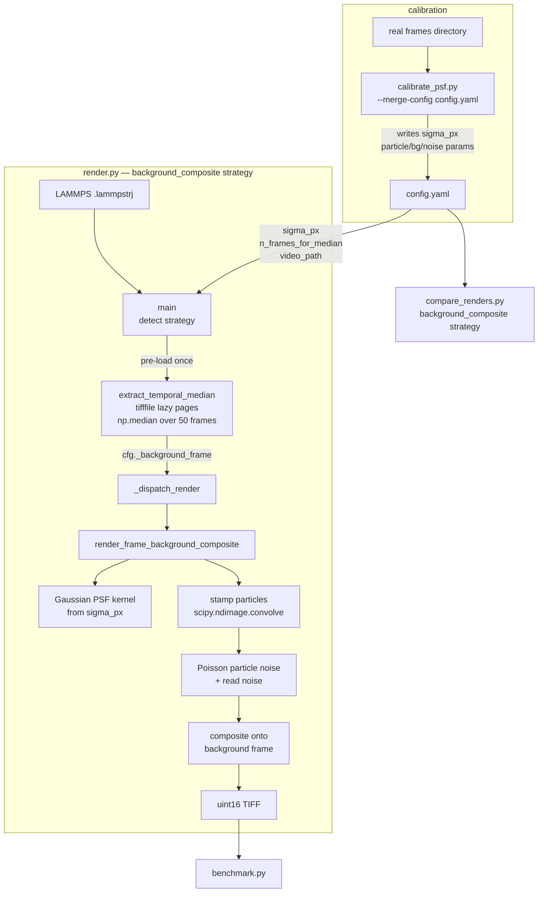

# feat: Calibrated PSF config merge and background composite render strategy

## Summary

Two targeted additions to `verification/` that close the two highest-impact gaps between current
synthetic renders and real microscopy frames:

**A — Calibrated PSF config merge:** `calibrate_psf.py` can already fit PSF, particle, background,
and noise parameters from real frames, but it only prints a YAML fragment for manual pasting.
A new `--merge-config` flag automates the merge into `config.yaml`.

**B — Background composite render strategy:** A new `background_composite` render strategy extracts
a temporal-median background from the real video, stamps calibrated Gaussian PSF particle signal at
LAMMPS positions on top, and adds Poisson shot noise to the particle signal only (the real background's
noise is already baked in). This strategy is wired into the existing `_dispatch_render` dispatch table
and `compare_renders.py`.

---

## Problem Frame

`calibrate_psf.py` outputs correct calibration values but requires manual copy-paste into
`config.yaml` — an error-prone step that breaks the calibration workflow. More importantly,
`psf.sigma_px` (the empirically fitted PSF width) is only consumed by `benchmark.py` for matching
thresholds; it has no consumer in any render strategy, leaving the calibrated value unused during
rendering.

The existing render strategies generate synthetic backgrounds from parametric models (smooth
Gaussian random fields). Real epi-fluorescence backgrounds have structured heterogeneity
(out-of-focus fluorescence, optical artefacts) that no closed-form model captures well. Temporal
median over real frames provides this background for free.

---

## Requirements

- R1. `calibrate_psf.py --merge-config <path>` deep-merges calibrated `psf`, `particle`,
  `background`, and `noise` params under `synthetic:` in the target `config.yaml`.
- R2. The merge preserves all existing config keys not touched by calibration.
- R3. Internal-only keys (`_gain_sigma_note`, `_meta`) are stripped before merge.
- R4. `render_background_composite.py` provides `extract_temporal_median` and
  `render_frame_background_composite` following the sibling-module strategy pattern.
- R5. `extract_temporal_median` loads a multi-page TIFF, randomly sub-samples up to
  `n_frames_for_median` pages, and returns a float32 temporal median.
- R6. `render_frame_background_composite` builds a Gaussian PSF kernel from
  `cfg["psf"]["sigma_px"]`, stamps particle signal at LAMMPS positions, applies Poisson noise to
  the particle canvas, adds Gaussian read noise, then composites onto the background frame.
- R7. Background is loaded once before the per-frame loop in `render.py main()` and passed via
  `cfg["_background_frame"]`; it is not recomputed per frame.
- R8. `render.py _dispatch_render` handles `"background_composite"` via the existing lazy-import
  strategy pattern.
- R9. `compare_renders.py --strategies` choices include `"background_composite"`.
- R10. `config.yaml` gains a documented `background_composite:` section and a `psf.sigma_px`
  comment explaining it is the calibration output consumed by this strategy.

---

## Key Technical Decisions

- **Pre-load background in `render.py main()`, not in the module** (see Approach A/B/C above):
  `main()` detects `render_strategy: background_composite` before the frame loop and injects the
  temporal median into `cfg["_background_frame"]`. No global state in
  `render_background_composite.py`, no modification to `_dispatch_render`'s signature, trivial
  to test by injecting the array directly.

- **Gaussian PSF kernel from `sigma_px`, not DeepTrack2**: `render_deeptrack._build_psf_kernel`
  requires `psf.na` / `psf.wavelength` / `psf.resolution` (physical params), not the empirically
  fitted `sigma_px`. For this strategy, build the kernel inline from `sigma_px` using
  `scipy.ndimage.gaussian_filter` on a delta canvas — no deeptrack dependency, consistent with
  calibration output.

- **Poisson noise on particle signal only**: The temporal median averages out shot noise from the
  real background; add Poisson noise only to the particle canvas before compositing.
  Add Gaussian read noise (from `cfg["noise"]["read_noise"]`) to the final composite. Do not add
  gain variation — the real background already encodes per-pixel gain structure.

- **50-frame default sub-sample**: 50 frames × 2200×3200 px × 2 bytes ≈ 704 MB in memory.
  Above 100 frames approaches 1.4 GB; 50 is the safety ceiling for the default.

- **Deep-merge via recursive dict update**: `calibrate_from_frames` returns a dict keyed by
  `psf`, `particle`, `background`, `noise`. `--merge-config` loads the existing YAML, recursively
  updates only those four sub-dicts under `synthetic:`, strips `_gain_sigma_note` and `_meta`,
  and writes back with `yaml.dump`. Non-target keys (e.g., `render_strategy`, `randomization`)
  are untouched.

- **`psf.sigma_px` is the calibration-to-render bridge**: After `--merge-config`, `config.yaml`
  contains `synthetic.psf.sigma_px` from calibration. `render_frame_background_composite` reads
  this key to set the Gaussian PSF width. `render_deeptrack` ignores it (unchanged). `benchmark.py`
  already reads it for matching threshold (unchanged).

---

## High-Level Technical Design



---

## Scope Boundaries

**In scope:**
- `verification/calibrate_psf.py` — add `--merge-config` flag
- `verification/render_background_composite.py` — new file
- `verification/render.py` — background pre-load in `main()`, new `_dispatch_render` branch
- `verification/compare_renders.py` — add strategy to `choices`
- `verification/config.yaml` — add `background_composite:` section; document `psf.sigma_px`
- `verification/tests/test_calibrate_psf.py` — extend with merge tests
- `verification/tests/test_render.py` — extend with `background_composite` tests

**Deferred to follow-up:**
- Per-frame background sampling (random real frame per synthetic frame) — deferred; single
  pre-computed median is sufficient for the eval use case
- DeepTrack2 PSF for particle stamps in `background_composite` — deferred; Gaussian from
  `sigma_px` is the correct bridge to calibrated output
- `extract_temporal_median` as a standalone CLI script — not needed for V1 since `main()` handles
  extraction transparently

**Outside scope:**
- Changes to `particle-tracking/`, `rf-detr/`, or `lammps-scripts/`
- Retraining any detector on the new renders
- Changes to `render_deeptrack.py` or `render_randomized.py`

---

## Risks & Dependencies

- **Memory**: 50 frames × 2200×3200 × 2 bytes = 704 MB for temporal median. Use lazy
  `tifffile.TiffFile` page access and `rng.choice` subsampling. If the video has fewer than 50
  pages, use all available pages.
- **Video path portability**: `background_composite.video_path` is a filesystem path in
  `config.yaml`. Use a relative path (relative to `verification/`) or an absolute path with
  documentation. The plan example uses a repo-relative path for clarity.
- **`sigma_px` absence**: If `calibrate_psf.py` has not yet been run, `psf.sigma_px` is absent
  from config. `render_frame_background_composite` must fall back to
  `cfg.get("psf_sigma", 5.0)` rather than raising `KeyError`.

---

## Implementation Units

### U1. `calibrate_psf.py` — `--merge-config` flag

**Goal:** Automate merging calibrated parameters into an existing `config.yaml`, eliminating
manual copy-paste and making `sigma_px` available to downstream render strategies.

**Requirements:** R1, R2, R3

**Dependencies:** none

**Files:**
- `verification/calibrate_psf.py` (modify)
- `verification/tests/test_calibrate_psf.py` (extend)

**Approach:** Add `--merge-config <path>` argument alongside the existing `--output-config`.
When given:
1. Load the target YAML with `yaml.safe_load`.
2. Ensure `config["synthetic"]` exists (create if absent).
3. For each of `psf`, `particle`, `background`, `noise`: recursively update `config["synthetic"]`
   sub-dict with the calibrated values. Use `dict.update` per sub-dict, not a full overwrite,
   so sibling keys (`na`, `wavelength`, `render_strategy`, etc.) are preserved.
4. Strip `_gain_sigma_note` from `noise` dict and drop `_meta` entirely before merge.
5. Write back with `yaml.dump(..., default_flow_style=False, sort_keys=False)`.

The existing `--output-config` behavior (write standalone fragment to a file) is unchanged.

**Patterns to follow:** `calibrate_psf.main()` arg-parse structure; `yaml.safe_load` / `yaml.dump`
used throughout the codebase.

**Test scenarios:**
- After `--merge-config`, `config["synthetic"]["particle"]["peak_mean"]` equals the calibrated
  value; pre-existing `render_strategy` key is preserved.
- `_gain_sigma_note` is absent from the merged config; `_meta` is absent.
- `config.yaml` at the given path does not exist: `FileNotFoundError` before any processing.
- Calibrated `psf.sigma_px` lands at `config["synthetic"]["psf"]["sigma_px"]` alongside any
  pre-existing `psf.na` and `psf.wavelength` (they must not be deleted).
- Merged YAML is parseable by `yaml.safe_load` (round-trip test).

**Verification:** Run `calibrate_psf.py --real-frames <dir> --merge-config config.yaml`; diff
`config.yaml` before and after; confirm particle/background/noise/psf sub-dicts updated with
calibrated values; confirm `render_strategy` unchanged.

---

### U2. `render_background_composite.py` — background extraction and composite render

**Goal:** Implement the two functions that together form the background composite strategy:
`extract_temporal_median` (load real video, return float32 background) and
`render_frame_background_composite` (stamp calibrated Gaussian PSF particles onto background).

**Requirements:** R4, R5, R6

**Dependencies:** none (standalone module; no other unit required)

**Files:**
- `verification/render_background_composite.py` (create)
- `verification/tests/test_render.py` (extend — add `TestBackgroundCompositeStrategy` class)

**Approach:**

`extract_temporal_median(video_path, n_frames=50, rng=None)`:
- Open with `tifffile.TiffFile(video_path)`; read `len(tf.pages)` for total page count.
- Sub-sample `min(n_frames, total_pages)` page indices without replacement using
  `rng.choice` (or `np.random.default_rng(0).choice` if `rng` is None).
- Load each selected page via `.pages[i].asarray()` into a stack; compute
  `np.median(stack, axis=0)`.
- Return `float32` array of shape `(H, W)`.

`render_frame_background_composite(positions_lj, box, cfg, rng)`:
1. Read `background = cfg["_background_frame"]` (pre-loaded by `render.py main()`).
2. Read `sigma = cfg.get("psf", {}).get("sigma_px") or cfg.get("psf_sigma", 5.0)`.
3. Build Gaussian PSF kernel: stamp a unit impulse at the kernel centre, apply
   `scipy.ndimage.gaussian_filter(impulse, sigma=sigma)`, normalize so `kernel.sum() == 1`.
4. Convert LAMMPS positions to pixel coords via the same `_lj_to_pixels` logic in `render.py`.
5. Sample per-particle intensities from lognormal distribution using `particle` sub-cfg
   (fall back to `cfg["peak_intensity"]` if `particle` section absent).
6. Stamp particles onto a zero canvas; convolve with PSF kernel via `scipy.ndimage.convolve`.
7. Apply Poisson noise to particle canvas: `rng.poisson(np.clip(particle_canvas, 0, None))`.
8. Add `rng.normal(0, read_noise, (H, W))` read noise (from `cfg.get("noise", {}).get("read_noise", 15.0)`).
9. Composite: `result = background + particle_canvas_noisy`.
10. Return `np.clip(result, 0, 65535).astype(np.uint16)`.

**Patterns to follow:**
- `render_deeptrack.render_frame_deeptrack` for noise model and shape
- `render_randomized.render_frame_randomized` for sibling-module `sys.path.insert` pattern
- `test_render.TestDeeptrackStrategy._import_with_mock_deeptrack` for mock injection pattern
  (mock `tifffile.TiffFile` via `sys.modules` injection before import)

**Test scenarios:**
- `extract_temporal_median` with a 10-page stub video (each page a 16×16 synthetic array)
  returns correct float32 shape and plausible median values.
- With 3 available pages and `n_frames=50`, uses all 3 (no out-of-bounds).
- `render_frame_background_composite` returns `uint16` array of shape `(H, W)` matching config.
- Background-only render (zero particles): output equals background + read noise, clipped.
- With particles: pixel at known particle position is elevated vs. background-only.
- Poisson noise applied: two calls with different `rng` seeds produce different particle signal.
- `cfg["_background_frame"]` absent: `KeyError` with a message indicating `main()` must pre-load.
- Sigma fallback: when `psf.sigma_px` is absent, falls back to `psf_sigma` without error.
- Output is correctly clipped to `[0, 65535]` even when background + particle signal would overflow.

**Verification:** Render 5 frames with `background_composite` strategy; visually confirm particle
spots are visible against real background texture in saved TIFFs.

---

### U3. `render.py` and `compare_renders.py` wiring

**Goal:** Hook the new strategy into the existing dispatch table and comparison tool, and pre-load
the background once before the per-frame loop.

**Requirements:** R7, R8, R9, R10

**Dependencies:** U2

**Files:**
- `verification/render.py` (modify)
- `verification/compare_renders.py` (modify)
- `verification/config.yaml` (modify)

**Approach:**

`render.py`:

In `_dispatch_render` (lines 140–174), add:
```
elif strategy == "background_composite":
    from render_background_composite import render_frame_background_composite
    return render_frame_background_composite(positions_lj, box, cfg, rng)
```

In `main()`, before the per-frame loop (after `strategy = cfg.get("render_strategy", "procedural")`):
```
if strategy == "background_composite":
    from render_background_composite import extract_temporal_median
    bc_cfg = cfg.get("background_composite", {})
    cfg["_background_frame"] = extract_temporal_median(
        bc_cfg["video_path"], bc_cfg.get("n_frames_for_median", 50), rng
    )
```

This keeps `_dispatch_render` signature unchanged and makes the extraction timing explicit.

`compare_renders.py` line ~103: add `"background_composite"` to the `choices` list in `--strategies`.

`config.yaml`: add the section below under `synthetic:` and document `psf.sigma_px`:

```yaml
# --- Background composite strategy ---
# sigma_px is written here by 'calibrate_psf.py --merge-config'; consumed by background_composite
# psf:
#   sigma_px: null   # uncomment and set after running calibrate_psf.py

background_composite:
  video_path: ../particle-tracking/data/raw/60% Intensity PS 5um Video Trial 1.tif
  n_frames_for_median: 50   # frames to subsample for temporal median (≤50 keeps memory ≤~700 MB)
```

**Patterns to follow:** Existing `elif strategy == "deeptrack":` / `elif strategy == "randomized":`
branches in `_dispatch_render`; lazy import + clear ImportError message pattern.

**Test scenarios (`test_render.py`):**
- `_dispatch_render` with `strategy="background_composite"` calls `render_frame_background_composite`
  (monkeypatch the function; assert it was called with correct args).
- `strategy="background_composite"` with `render_background_composite` missing raises `ImportError`
  with an informative message (follow existing guard pattern).
- `render.py main()` with `background_composite` strategy calls `extract_temporal_median` exactly once
  regardless of the number of frames rendered (stub both functions; assert call counts).
- `compare_renders.py` accepts `--strategies background_composite` without argparse error.

**Verification:** `uv run python render.py --lammps <path> --config config.yaml` with
`render_strategy: background_composite`; confirm `synthetic_frames/frame_*.tif` are written and
`snr_psd_scores.csv` gains a `background_composite` row via `compare_renders.py`.

---

## Sources & Research

- Real video files: `particle-tracking/data/raw/*.tif` — 300 frames, 2200×3200 px, uint16.
  Lazy page access via `tifffile.TiffFile(...).pages[i].asarray()` (pattern from
  `data-setup/lodestar_autolabeler.py` lines 158, 166).
- `render_deeptrack._build_psf_kernel`: imports confirmed importable from sibling module
  (same `sys.path.insert` pattern as `render_randomized.py` lines 27–29).
- `_dispatch_render` dispatch structure: `render.py` lines 140–174.
- `compare_renders.py` strategy `choices` list: line ~103.
- Memory budget: 50 × 2200 × 3200 × 2 bytes ≈ 704 MB.
- `sigma_px` in `benchmark.py`: consumed at line 270 via `_cfg_get(cfg, "synthetic", "psf", "sigma_px", default=5.0)`.
- Existing plan: `docs/superpowers/plans/2026-06-15-001-feat-synthetic-rendering-verification-plan.md`
  (U1–U7 — implemented the base rendering system this plan extends).
