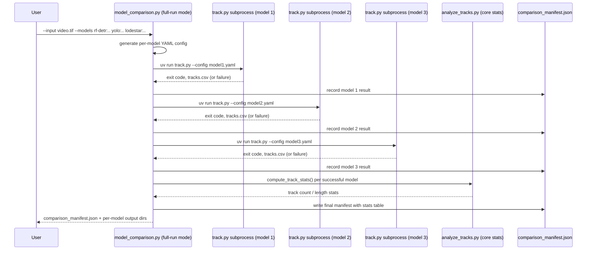
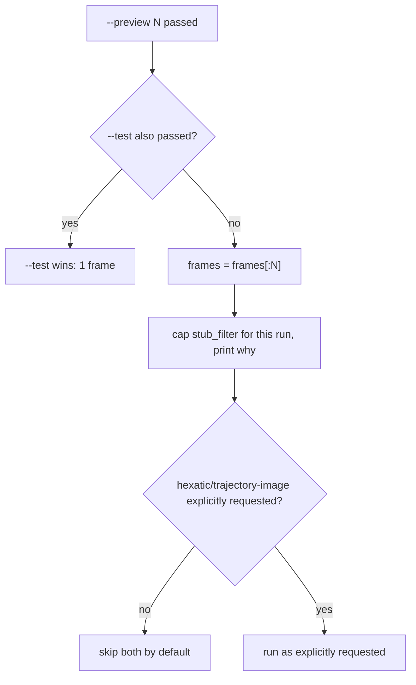

# feat: Multi-model tracking comparison, fast preview, and tracks metrics tool

## Summary

This plan adds three capabilities to `particle-tracking/`: a one-command multi-model comparison mode that runs the same input through rf-detr, yolo, and lodestar as full tracking runs; a `--preview` mode on `track.py` that sanity-checks a model/config choice on a small frame count before committing to a multi-hour run; and a standalone `analyze_tracks.py` tool that reports descriptive statistics (track count, length distribution, density, hexatic order, MSD) from any existing `tracks.csv`, with no ground truth required.

## Problem Frame

`particle-tracking/track.py` already supports rf-detr, yolo, and lodestar, but comparing them today means editing `config.yaml` and re-running the full pipeline once per model — each run can take hours (one recent lodestar run in this repo ran nearly 6 hours). `particle-tracking/model_comparison.py` exists but only compares single-frame detections, not full tracking runs, so it can't surface comparable per-model signal — track count, length distribution — for a human to judge between models. There is no fast way to catch a bad model or config choice before paying for a full run, and no way to inspect track-level statistics (count, length, density, hexatic order, MSD) without either eyeballing an annotated video or writing a one-off script. `metrics.json` (via `compute_and_save_metrics`, `particle-tracking/track.py:628-682`) covers only track count/length for a single freshly-completed run and is never written for `.lammpstrj`-derived runs.

## Requirements

**Multi-model comparison**

- R1. A single command runs one input through multiple detection models (rf-detr, yolo, lodestar) as full tracking runs — detection, linking, and `tracks.csv` output per model — not single-frame detection only.
- R2. Comparison output includes a manifest tying the per-model runs together (config used, output directory, exit status, duration) so a partial or failed run is visible without manually checking each directory.
- R3. Comparison output includes a per-model at-a-glance stats table (track count, length distribution) without a separate manual command, and flags when compared models used materially different tracker tuning (`stub_filter`/`search_range`) so the stats aren't read as an apples-to-apples verdict by default.

**Preview mode**

- R4. A preview mode runs the full pipeline (detection, tracking, annotated output) on a small, bounded number of frames and completes fast enough to sanity-check a choice before a full run.
- R5. Preview mode does not silently report zero tracks purely because full-run tracker defaults (e.g. `stub_filter`) don't fit a short frame count, and separately reports (log-only, non-gating) what the full run's un-relaxed `stub_filter` would have produced on the same frames, so a passing preview isn't mistaken for a guarantee the full run's own settings will also pass.

**Metrics tool**

- R6. A standalone tool computes track count, track length distribution, particle density, hexatic order, and MSD from any existing `tracks.csv` — both the detection schema (`frame, track_id, x, y, w, h, conf`) and the `.lammpstrj` schema (`frame, timestep, track_id, x, y`) — with no ground truth and no live tracking run required.
- R7. The tool degrades gracefully instead of crashing on edge-case input: an empty/zero-detection `tracks.csv`, a missing `freud` dependency, or sparse per-frame particle counts.
- R8. The tool's core statistics function is importable so other tools (the comparison manifest) can reuse it without shelling out to a CLI.

## Key Technical Decisions

**Multi-model comparison**

- **Extends `model_comparison.py` with a new full-run mode, executed via per-model subprocess:** the existing `--models type:checkpoint` CLI shape (`ModelSpec`, `parse_model_spec`, `particle-tracking/model_comparison.py:13-47`) carries over into a new mode triggered by an `--input` (video/TIFF/folder) argument alongside `--image`. Each model's full tracking run executes as its own `uv run python track.py --config <generated-yaml>` subprocess rather than reusing `model_comparison.py`'s current in-process sequential model-loading loop. Reason: `track.py`'s RF-DETR loader (`get_rfdetr_model`, `particle-tracking/track.py:71-122`) evicts and reloads `torch`/`torchvision` in `sys.modules` in-process to bridge the CUDA version mismatch between particle-tracking's torch and rf-detr's torch — tolerable for one single-frame inference call, but not safe across sequential multi-hour tracking runs for other models in the same interpreter.
- **Per-model tracker defaults, not forced-identical params, sourced from a shared config-writer module:** each model keeps its own tuned `search_range`/`memory`/`stub_filter`. Rather than U4 reimplementing these defaults independently, `write_rfdetr_config`/`write_lodestar_config` (currently hardcoded inside `run_tracking.py`, `particle-tracking/run_tracking.py:132-248`) are extracted into a shared module (U6) that both `run_tracking.py` and `model_comparison.py` import, so the two scripts can't silently drift apart if these defaults are retuned later. Per `docs/brainstorms/2026-06-20-lodestar-long-tracks-requirements.md`, lodestar's noisy ~800 detections/frame need a low `stub_filter` tuned for that noise profile; applying rf-detr's `stub_filter: 90` to lodestar output (or vice versa) produces meaningless track counts, not a fair comparison.
- **Sequential execution, concurrency deferred:** models run one after another by default. `run_tracking.py`'s `detect_parallelism()` (`particle-tracking/run_tracking.py:254-275`) only budgets GPU memory for one model type at a time; extending it to reason about concurrent heterogeneous footprints (rf-detr + yolo + lodestar simultaneously) is real scheduling work with real OOM risk on multi-hour runs, deferred rather than rushed (see Scope Boundaries).
- **A `comparison_manifest.json` at the top of the output tree** records per-model config path, output directory, exit code, duration, and — for models that completed successfully — a stats summary pulled from `analyze_tracks.py`'s core function. Hexatic order and MSD stay opt-in via the standalone tool rather than auto-computed in the manifest, since they're the more expensive/optional statistics. When compared models used materially different `stub_filter`/`search_range` values (the normal case, per the previous decision), the manifest flags this explicitly next to the stats table so raw track-count differences aren't read as a pure detector-quality signal — the plan's own per-model tuning decision means they aren't one.
- **One model's failure doesn't stop the others:** the orchestrator continues to the next model on a non-zero exit code and records the failure in the manifest rather than aborting the whole comparison.

**Preview mode**

- **A new `--preview N` flag, composing with (not replacing) `--max-frames`/`--test`:** silently changing `--max-frames`' existing behavior would surprise current callers who use it for reasons other than a quick preview. Precedence mirrors the existing `--test` vs `--max-frames` relationship (`particle-tracking/track.py:992`): `--test` > `--preview` > `--max-frames`.
- **Preview relaxes `stub_filter` for its own run and prints why:** with today's defaults (`stub_filter: 90` for rf-detr, `6` for lodestar), a short preview would report zero tracks regardless of model quality purely because `trackpy.filter_stubs` discards anything shorter than `stub_filter` frames — the opposite of what a fast sanity check should do.
- **Preview additionally reports, log-only, what the full run's un-relaxed `stub_filter` would have produced on the same frames:** relaxing `stub_filter` validates that detection and linking work at all, but not that the full run's own (unrelaxed) setting is a good fit for the observed track-length distribution — the same parameter a full run depends on for its own success. Printing this count alongside the relaxed result gives a second, non-gating signal without changing what preview actually runs.
- **Preview skips hexatic-order and trajectory-image generation by default:** both are likely near-empty or misleading on a handful of frames (`calc_hexatic_from_tracks` silently skips frames with fewer than 6 particles). An explicit `--hexatic-order` or trajectory flag still forces them on, consistent with the existing CLI-overrides-config precedence already used throughout `track.py`.
- **Frame selection stays a literal first-N prefix**, matching `--max-frames`' existing semantics (`frames[:max_frames]`, `particle-tracking/track.py:1104-1105`) rather than evenly-spaced sampling. Simpler and predictable; the limitation (not representative of drift across a long acquisition) is documented, not engineered around, for this pass.

**Metrics tool**

- **New standalone script `particle-tracking/analyze_tracks.py`** exposing an importable `compute_track_stats(tracks_csv_path, ...)` core plus a CLI, so the comparison manifest (R3) can call it in-process without shelling out.
- **Always recomputes from `tracks.csv`, never trusts a sibling `metrics.json`:** `metrics.json` can be stale relative to re-tuned tracker settings, and is never written at all for `.lammpstrj`-derived runs (`particle-tracking/track.py`'s `.lammpstrj` branch returns before calling `compute_and_save_metrics`). Recomputing is the only path that works uniformly across both schemas.
- **Reuses existing hexatic order and MSD implementations rather than reimplementing them:** `calc_hexatic_from_tracks` (`lammps-scripts/hexatic_order_analysis.py:76-106`) and `compute_msd` (`verification/compare.py`) are pulled in via the cross-venv `sys.path` injection pattern from `verification/compare.py:27-33`, since `freud` only lives in `lammps-scripts/.venv`. `track.py`'s own hexatic-order block (`particle-tracking/track.py:1385-1394`) uses a narrower version of this pattern that only inserts the venv's site-packages, not `lammps-scripts/` itself — `from hexatic_order_analysis import ...` then raises `ModuleNotFoundError` there today, so `track.py`'s existing `--hexatic-order` flag silently never succeeds. U3 must follow `verification/compare.py`'s version, not `track.py`'s.
- **Frame width/height for density and hexatic order come from an extent-based approximation with an override:** neither `tracks.csv` schema carries frame dimensions. `track.py` itself sidesteps this because it still has the loaded frames in memory (`frames[0].shape[:2]`, `particle-tracking/track.py:1395`) — a standalone tool pointed at a bare CSV does not. Default to `verification/compare.py`'s existing `x.max() * 1.1` / `y.max() * 1.1` approximation with a printed caveat, and accept explicit `--frame-width`/`--frame-height` overrides.
- **Distinguishes "hexatic unavailable" from "hexatic computed but sparse":** an `ImportError` (freud/`lammps-scripts/.venv` missing) is reported differently from a result where most frames were skipped for having fewer than 6 particles. Conflating the two into one blank/near-empty result defeats the tool's main use case — auditing historical runs whose tuning is unknown.

## High-Level Technical Design

**Multi-model comparison orchestration**



Models run sequentially; a failed model is recorded and skipped, and the remaining models still run.

**Preview mode gating**



Independent of this gating, preview always prints a log-only estimate of what the full run's un-relaxed `stub_filter` would have produced on the same frames (KTD, Preview mode).

## Implementation Units

### U1. Preview mode in track.py

**Goal:** Add a `--preview N` flag that runs the full pipeline on a small frame count with tracker settings that won't misreport zero tracks.

**Requirements:** R4, R5

**Dependencies:** none

**Files:**
- `particle-tracking/track.py` (argparse block, frame-truncation logic near `particle-tracking/track.py:992`, `stub_filter`/hexatic/trajectory-image resolution near `particle-tracking/track.py:925-987`)
- `particle-tracking/tests/test_track.py` (new)

**Approach:** Add `--preview` alongside the existing `--max-frames`/`--test` flags with the precedence `--test` > `--preview` > `--max-frames`. When preview is active, cap the effective `stub_filter` to a value that fits the preview's frame count (directional only — e.g. capped relative to the preview length, not the full-run default) and print the adjustment so the user knows why the number differs from a full run. Separately, compute (log-only, does not affect the reported track set) how many tracks would have survived the configured full-run `stub_filter` on the same frames, and print that count alongside the relaxed result. Default `save_hexatic_order` and `save_trajectory_image` to off when preview is active unless the corresponding flag was explicitly passed, reusing the same explicit-flag-wins-over-mode-default posture already used for `video_labels` (`particle-tracking/track.py:994-999`).

**Patterns to follow:** The `args.X if args.X is not None else cfg_get(...)` precedence pattern (`particle-tracking/track.py:917-928`); the explicit-flag-pair-wins pattern from `video_labels`/`no_video_labels` (`particle-tracking/track.py:994-999`).

**Test scenarios:**
- Happy path: `--preview 20` on a config with `stub_filter: 90` produces at least one track when detections exist across the 20 frames (stub_filter was effectively relaxed).
- Happy path: `--preview` prints the adjusted `stub_filter` value and the reason.
- Happy path: `--preview` prints the log-only full-run-`stub_filter` track count alongside the relaxed result, and the two counts can legitimately differ.
- Edge case: `--preview` combined with `--test` — `--test`'s 1-frame truncation wins.
- Edge case: `--preview` combined with a smaller explicit `--max-frames` — preview still applies its stub_filter relaxation logic to whichever frame count is actually used.
- Edge case: `--preview` with zero detections in all N frames — no crash, reports zero tracks with the same output shape as a full run.
- Integration: `--preview N --hexatic-order` (hexatic explicitly requested) still computes hexatic order despite preview mode's default skip.
- Integration: `--preview N` with no `--hexatic-order` skips the hexatic computation entirely (no cross-venv `freud` import attempted).

**Verification:** Running `track.py --preview 20` against an existing config completes in well under the time a full run would take, and reports a non-zero track count when the un-truncated input has trackable particles.

---

### U2. Metrics tool core: schema handling, track stats, density

**Goal:** Build `analyze_tracks.py` with an importable core that reads any `tracks.csv`, detects its schema, and computes track count, length distribution, and particle density without crashing on edge-case input.

**Requirements:** R6, R7, R8

**Dependencies:** none

**Files:**
- `particle-tracking/analyze_tracks.py` (new)
- `particle-tracking/tests/test_analyze_tracks.py` (new)

**Approach:** `compute_track_stats(tracks_csv_path, frame_width=None, frame_height=None, ...) -> dict` loads the CSV defensively (an empty/zero-detection `tracks.csv` from `track.py` is a bare newline and raises `pandas.errors.EmptyDataError` on a naive `pd.read_csv` — handle this before touching columns), detects schema by column presence (`timestep` and absence of `w`/`h`/`conf` implies the `.lammpstrj` schema), and computes track count / length distribution mirroring `compute_and_save_metrics`'s field names (`n_tracks`, `track_length_mean/median/max/min`, `particle-tracking/track.py:628-660`) for consistency. Particle density uses frame width/height from explicit `--frame-width`/`--frame-height` flags when given, else falls back to the extent-based approximation (`x.max() * 1.1`, `y.max() * 1.1`) with a printed caveat that the value is approximate. CLI wraps the core with `--tracks`, `--frame-width`, `--frame-height`, and a human-readable stdout summary plus an optional `--json` output path.

**Patterns to follow:** `compute_and_save_metrics`'s field naming and empty-tracks handling shape (`particle-tracking/track.py:628-682`); `verification/compare.py`'s extent-based frame-size approximation; the mocked-heavy-dependency pytest style from `particle-tracking/tests/test_model_comparison.py`.

**Test scenarios:**
- Happy path: detection-schema `tracks.csv` with several tracks of varying length produces correct `n_tracks`, length mean/median/max/min, and a density figure.
- Happy path: `.lammpstrj`-schema `tracks.csv` (no `w`/`h`/`conf` columns) is detected correctly and produces track stats without erroring on missing columns.
- Edge case: an empty/bare-newline `tracks.csv` (matching `track.py`'s zero-detection output) does not raise `EmptyDataError` and reports zero tracks.
- Edge case: `tracks.csv` with a single track / single frame.
- Edge case: density computed via the extent-approximation path prints the caveat; density computed via explicit `--frame-width`/`--frame-height` does not.
- Error path: a `tracks.csv` path that doesn't exist produces a clear CLI error, not a traceback.
- Integration: `compute_track_stats()` is callable directly (not just via CLI subprocess) with a plain dict return, for reuse by U4's comparison manifest.

**Verification:** Running `analyze_tracks.py --tracks <path>` against both schema shapes (including the four already-completed lodestar batch-run outputs) produces stats without crashing.

---

### U3. Metrics tool: hexatic order and MSD

**Goal:** Extend `analyze_tracks.py` with hexatic order and MSD, reusing existing implementations, with clear degradation when `freud` is unavailable or data is sparse.

**Requirements:** R6, R7

**Dependencies:** U2

**Files:**
- `particle-tracking/analyze_tracks.py`
- `particle-tracking/tests/test_analyze_tracks.py`

**Approach:** Import `calc_hexatic_from_tracks` from `lammps-scripts/hexatic_order_analysis.py` via the cross-venv `sys.path` injection pattern in `verification/compare.py:27-33` (inserts `lammps-scripts/` itself, then its venv's site-packages — `track.py:1385-1394`'s narrower version omits the first insert and never actually succeeds, so it is not a valid pattern to copy), wrapped in a try/except that distinguishes `ImportError` (report "hexatic unavailable — freud not installed") from a successful-but-sparse result (report how many of the input frames were skipped for having fewer than 6 particles, not just the frames that did compute). Import `compute_msd` from `verification/compare.py` for time/ensemble-averaged MSD; report in native pixel/frame-index units by default, with optional `--pixel-scale` for physically meaningful output when the caller supplies it. Both are opt-in via CLI flags (e.g. `--hexatic`, `--msd`) rather than always-on, since they're the heavier computations.

**Patterns to follow:** The cross-venv `sys.path` injection and try/except-ImportError shape in `verification/compare.py:27-45`; `verification/compare.py`'s existing `compute_msd` signature and scale handling.

**Test scenarios:**
- Happy path: hexatic order computed on a `tracks.csv` with consistently 6+ particles per frame returns a per-frame series with no skipped frames.
- Edge case: `tracks.csv` where most frames have fewer than 6 particles — result reports a nonzero skip count distinctly from "unavailable."
- Error path: `freud` / `lammps-scripts/.venv` not present — reports "hexatic unavailable," does not crash the rest of the tool's output.
- Happy path: MSD computed on a multi-track `tracks.csv` returns a lag/MSD series in native units by default.
- Edge case: MSD requested with `--pixel-scale` returns values in physical units, and the output labels which units were used.
- Integration: hexatic and MSD are opt-in — a plain `analyze_tracks.py --tracks <path>` run (no `--hexatic`/`--msd`) does not attempt the cross-venv import at all.

**Verification:** Running with `--hexatic --msd` against a real completed run's `tracks.csv` produces both statistics; running against a `tracks.csv` with sparse per-frame counts clearly labels the hexatic result as sparse rather than silently near-zero.

---

### U6. Extract shared tracker-config module

**Goal:** Move the per-model tracker-default config writers out of `run_tracking.py` into a shared module both `run_tracking.py` and `model_comparison.py` import, so per-model tuning can't silently drift between the two scripts.

**Requirements:** R1 (fair, consistent per-model comparison), R3 (tuning-difference caveat depends on both scripts sourcing the same defaults)

**Dependencies:** none

**Files:**
- `particle-tracking/tracker_configs.py` (new)
- `particle-tracking/run_tracking.py` (refactor: import from the new module instead of defining `write_rfdetr_config`/`write_lodestar_config` locally)
- `particle-tracking/tests/test_tracker_configs.py` (new)

**Approach:** Move `write_rfdetr_config`/`write_lodestar_config` (`particle-tracking/run_tracking.py:132-248`) into `particle-tracking/tracker_configs.py`, generalizing their signature to accept an explicit `output_dir` parameter instead of reading the module-level `RESULTS_BASE` constant. `run_tracking.py` imports the extracted functions and calls them with its existing `RESULTS_BASE`-derived paths, so its own batch-run behavior and output are unchanged. `model_comparison.py` (U4) imports the same functions with its own per-comparison output directory. `run_tracking.py`'s hardcoded `VIDEOS` dict, GPU-aware parallelism logic, and overall batch-runner behavior are untouched — only the config-writer functions move.

**Patterns to follow:** The existing `write_rfdetr_config`/`write_lodestar_config` bodies as the extraction source — YAML content generation logic is unchanged, only the output-path parameterization changes.

**Test scenarios:**
- Happy path: `write_rfdetr_config(output_dir=X, ...)` produces YAML content equivalent to today's `run_tracking.py`-generated config, just rooted at `X` instead of the hardcoded `RESULTS_BASE`.
- Happy path: `write_lodestar_config` likewise.
- Integration: `run_tracking.py`'s existing batch-run workflow (run against its hardcoded `VIDEOS` dict) produces the same generated config content as before the refactor, for the same inputs.
- Edge case: no writer exists yet for yolo — this unit does not add one; that gap is pre-existing and untouched.

**Verification:** `run_tracking.py`'s existing batch-run behavior is unchanged (same generated YAML for the same inputs) after the refactor, and `model_comparison.py` (U4) can call the same functions directly.

---

### U4. Multi-model full-run comparison mode

**Goal:** Add a full-run comparison mode to `model_comparison.py` that runs multiple models as full tracking runs against one input and writes a comparison manifest.

**Requirements:** R1, R2, R3

**Dependencies:** U2 (manifest stats table calls `compute_track_stats`), U6 (shared tracker-config module)

**Files:**
- `particle-tracking/model_comparison.py`
- `particle-tracking/tests/test_model_comparison.py`

**Approach:** Add an `--input` argument (mutually exclusive with the existing `--image`) that switches `model_comparison.py` into full-run mode. For each `ModelSpec` in `--models`, generate a per-model YAML config via the shared `write_rfdetr_config`/`write_lodestar_config` functions from U6 (output directory nested under `{output_dir}/{model_type}/` to avoid collisions between models) and run it as `subprocess.run(["uv", "run", "python", "-u", "track.py", "--config", <path>], cwd=SCRIPT_DIR)`, matching the subprocess shape already proven in `run_tracking.py`'s `run_batch` (`particle-tracking/run_tracking.py:281-320`). Continue to the next model on a non-zero exit code, recording the failure. After each model completes (success or failure), call `compute_track_stats()` from U2 for successful runs and write a `comparison_manifest.json` at the top of the output tree with per-model config path, output directory, exit code, duration, stats summary, and a flag when the compared models' `stub_filter`/`search_range` values differ materially.

**Technical design:** Directional shape of the manifest (not a literal schema to implement verbatim):
```
{
  "input": "...",
  "tuning_differs": true,
  "models": [
    {"model_type": "rf-detr", "config": "...", "output_dir": "...",
     "exit_code": 0, "duration_s": 1234, "stats": {"n_tracks": ..., ...}},
    {"model_type": "yolo", ..., "exit_code": 1, "error": "..."}
  ]
}
```

**Patterns to follow:** `ModelSpec`/`parse_model_spec` CLI shape (`particle-tracking/model_comparison.py:13-47`); `run_tracking.py`'s subprocess job-pool pattern (`particle-tracking/run_tracking.py:281-320`) as a conceptual reference for the subprocess invocation; the shared config-writer functions from U6 for actual config generation (not a conceptual reference — a real shared import).

**Test scenarios:**
- Happy path: `--input video.tif --models rf-detr:.. yolo:.. lodestar:..` runs all three, writes per-model output under distinct subdirectories, and produces a manifest with all three entries and stats.
- Happy path: the manifest sets `tuning_differs: true` when rf-detr's and lodestar's default `stub_filter` values (90 vs 6) both appear in the same comparison run.
- Edge case: one model's config generation or subprocess invocation fails (bad checkpoint path) — the manifest records the failure, and the remaining models still run to completion.
- Edge case: `--image` and `--input` passed together — clear CLI error (mutually exclusive).
- Edge case: two models given the same output directory would collide — verify the per-model subdirectory convention prevents this.
- Integration: the manifest's stats entries match what `analyze_tracks.py --tracks <that model's tracks.csv>` reports independently, for at least one model.
- Integration: existing single-frame `--image` comparison mode (`particle-tracking/model_comparison.py`'s current behavior) is unaffected by the new `--input` mode.

**Verification:** Running the new mode against a small real input with all three models produces three populated output directories and a manifest whose stats entries are corroborated by an independent `analyze_tracks.py` run against the same `tracks.csv` files.

---

### U5. Documentation

**Goal:** Document the three new capabilities so they're discoverable without reading source.

**Requirements:** R1-R8 (usability of all of the above)

**Dependencies:** U1, U2, U3, U4

**Files:**
- `particle-tracking/README.md`

**Approach:** Add usage sections for the full-run comparison mode, `--preview`, and `analyze_tracks.py`, and extend the existing CLI reference table (`particle-tracking/README.md`'s CLI Reference section) with the new flags.

**Test expectation:** none -- documentation only, no behavioral change to verify.

**Verification:** README examples are runnable as written against the repo's existing config presets.

## Acceptance Examples

- **AE1 (preview doesn't misreport zero tracks, and doesn't overclaim full-run success).** Given a config with `stub_filter: 90` and real particles present in the first 20 frames of an input, when run with `--preview 20`, then the run reports at least one track using its relaxed `stub_filter` and prints that the value was adjusted for the preview — not a bare "0 tracks" result indistinguishable from total failure — and also prints, log-only, how many tracks the configured full-run `stub_filter: 90` would have produced on the same 20 frames, so a passing preview isn't read as a guarantee the full run will pass too.
- **AE2 (metrics tool degrades gracefully).** Given a `tracks.csv` that is a bare newline (the shape `track.py` writes for a zero-detection run), when run through `analyze_tracks.py`, then the tool reports zero tracks and does not raise `EmptyDataError` or any other unhandled exception.
- **AE3 (hexatic sparse vs. unavailable).** Given a `tracks.csv` where most frames have fewer than 6 particles, when hexatic order is requested, then the output reports a skip count distinct from the case where `freud` itself is missing.

## Scope Boundaries

### Deferred to Follow-Up Work

- GPU-aware concurrent scheduling for multi-model comparison runs (models run sequentially in this plan).
- Evenly-spaced frame sampling for preview mode (this plan uses a literal first-N prefix).
- Ground-truth/MOT metrics (motmetrics, MOTA/IDF1) against the `verification/` synthetic pipeline — explicitly out of scope per the confirmed plan scope.
- Expanding `track.py`'s `run_meta`/`metrics.json` to record `memory`/`stub_filter`/`search_range` for provenance auditing — would help interpret cross-run/cross-model differences but isn't required for any of R1-R8 to function, since the metrics tool always recomputes from `tracks.csv` directly.
- Auto-computing hexatic order and MSD (not just track count/length) inside the comparison manifest by default — kept opt-in via the standalone tool.
- Fixing `track.py`'s own `--hexatic-order` flag, which this plan's research found to be currently non-functional (its `sys.path` injection is missing the `lammps-scripts/` directory-itself insert that `verification/compare.py`'s working version has, so it always falls into the "unavailable" branch). U3 uses the correct pattern from `verification/compare.py` and is unaffected, but `track.py`'s own flag stays broken until a separate fix lands.

### Outside This Work's Scope

- `run_tracking.py`'s own batch-run behavior, hardcoded video list, and GPU-aware parallelism logic are not touched or generalized. U6 extracts its config-writer functions into a shared module that `run_tracking.py` then imports from, but its runtime behavior and output are unchanged — this is a refactor for reuse, not a behavior change.
- `verification/`'s synthetic ground-truth benchmark pipeline is not touched.
- A browser/gallery UI for previously completed run outputs — not part of "preview."

## Risks & Dependencies

- **In-process torch eviction hazard if the subprocess design is later "simplified" away.** `track.py`'s RF-DETR loader evicts `torch`/`torchvision` from `sys.modules` in-process (`particle-tracking/track.py:71-122`). U4's design deliberately avoids ever calling `track.py`'s model-loading functions in-process across model types within one interpreter; this constraint should stay explicit in code comments, not just this plan, since it's the kind of shortcut a future edit might reintroduce.
- **Multi-hour run cost compounds under sequential comparison.** Three sequential full runs (rf-detr, yolo, lodestar) on a large input could take significantly longer than any single run today (one existing run took ~6 hours). This is a known, accepted cost of the sequential-by-default decision (see Key Technical Decisions), not a defect to fix in this pass.
- **`freud` availability is an external, pre-existing dependency** (only in `lammps-scripts/.venv`) that this plan does not change — U3's hexatic support is only as reliable as that existing cross-venv setup.
- **No signal handling on the comparison orchestrator.** A Ctrl-C during a multi-model comparison may leave orphaned `track.py` subprocesses holding GPU memory, matching `run_tracking.py`'s existing behavior today. Not addressed in this pass.
- **U6's extraction touches `run_tracking.py`, a script this plan otherwise avoids modifying.** The refactor is scoped tightly (move two functions, add an `output_dir` parameter, no behavior change), and U6's verification requires byte-equivalent generated YAML before/after — but any regression here would affect the existing hardcoded batch-runner workflow that produced the four completed lodestar runs referenced earlier in this plan's research.

## Sources & Research

- `particle-tracking/track.py:71-122` — `get_rfdetr_model`, in-process `sys.path`/`sys.modules` torch eviction (not subprocess isolation).
- `particle-tracking/track.py:628-682` — `compute_and_save_metrics`, existing `metrics.json` field naming to mirror.
- `particle-tracking/track.py:917-999` — CLI-overrides-config precedence pattern, including the `video_labels`/`no_video_labels` explicit-flag-pair convention.
- `particle-tracking/track.py:1104-1105` — `--max-frames`/`--test` frame truncation (`frames[:max_frames]`).
- `particle-tracking/track.py:1385-1412` — hexatic order cross-venv `sys.path` injection and `ImportError` handling; this version only inserts the venv's site-packages, not `lammps-scripts/` itself, so `--hexatic-order` currently raises `ModuleNotFoundError` internally and always falls into the "unavailable" branch. Not the pattern to copy for U3 — see `verification/compare.py:27-33` instead.
- `particle-tracking/model_comparison.py:13-290` — existing `ModelSpec`/`parse_model_spec`/`_rfdetr_infer_subprocess`/`build_comparison_figure` single-frame comparison tool being extended.
- `particle-tracking/run_tracking.py:132-320` — `write_rfdetr_config`/`write_lodestar_config` (extracted into a shared module by U6, then imported by both `run_tracking.py` and U4), plus `detect_parallelism`/`run_batch` (the subprocess job-pool pattern used as a conceptual reference for U4, not a shared import).
- `verification/compare.py:27-45` — working cross-venv `sys.path` injection (adds `lammps-scripts/` itself, then its venv's site-packages), `compute_msd`, and the extent-based frame-size approximation, reused by U3.
- `lammps-scripts/hexatic_order_analysis.py:76-106` — `calc_hexatic_from_tracks`, reused by U3.
- `docs/brainstorms/2026-06-20-lodestar-long-tracks-requirements.md` — rationale for per-model tracker defaults (KTD2) and the noise-vs-signal track-length skew a metrics tool should not mistake for a bug.
- `particle-tracking/tests/test_model_comparison.py` — existing pytest conventions (mocked heavy deps, `matplotlib.use("Agg")`, `Test<Thing>` classes) to follow in new test files.
