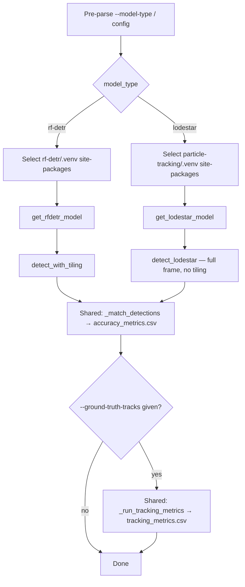

# feat: Add LodeSTAR support to verification benchmark pipeline

## Summary

`verification/benchmark.py` currently only supports RF-DETR when measuring detection accuracy against synthetic, ground-truth-labeled frames from `render.py`. This plan wires LodeSTAR in as a second selectable `--model-type`, reusing the exact model-loading and detection logic already proven in `particle-tracking/track.py`, so LodeSTAR's precision/recall/F1 (and optional MOTA/IDF1) can be measured against the same synthetic pipeline RF-DETR already uses — and actually runs it once, end-to-end, to confirm the integration works on live GPU inference.

---

## Problem Frame

`verification/benchmark.py` loads and runs RF-DETR exclusively — `get_rfdetr_model()` is the only model loader in the file, and there is no LodeSTAR code path anywhere in `verification/`. LodeSTAR detection has only ever been exercised on real experimental data via `particle-tracking/track.py` (`get_lodestar_model`, `detect_lodestar`), never against the simulated ground-truth frames `render.py` produces from LAMMPS trajectories. There is currently no way to answer "how accurate is LodeSTAR on data with known particle positions" the way RF-DETR's one (failing, 0-detection) benchmark run already attempted to answer for RF-DETR.

Separately, `verification/`'s own venv runs Python 3.13, while the venvs that hold PyTorch-based detector dependencies (`rf-detr/.venv` for `rfdetr`, `particle-tracking/.venv` for `deeplay`/`torch`/`supervision`) run Python 3.11 — `benchmark.py` already re-execs into `rf-detr/.venv`'s interpreter and injects its site-packages to work around this for RF-DETR. LodeSTAR's dependencies live in `particle-tracking/.venv`, not `rf-detr/.venv`, so the existing re-exec logic must become model-type aware rather than hardcoded to one venv.

---

## Requirements

- R1. `verification/benchmark.py` supports LodeSTAR as a second selectable detector via `--model-type {rf-detr,lodestar}` (default `rf-detr`), with existing invocations that omit the flag unaffected.
- R2. LodeSTAR detection reuses the existing model-loading and detection logic from `particle-tracking/track.py` (`get_lodestar_model`, `detect_lodestar`) rather than a reimplementation, so sigma-to-pixel scaling and NMS behavior stay identical to the production tracker.
- R3. LodeSTAR's dependencies (`deeplay`, `torch`, `supervision`) resolve from `particle-tracking/.venv` at runtime — the same cross-venv pattern `benchmark.py` already uses for RF-DETR against `rf-detr/.venv` — without requiring `rf-detr/.venv` to exist when only the LodeSTAR path is used.
- R4. Per-frame precision/recall/F1 output (`accuracy_metrics.csv`) and optional MOTA/IDF1 tracking metrics (`tracking_metrics.csv`) work identically for both model types — no LodeSTAR-specific changes to matching or tracking-metrics logic.
- R5. `verification/config.yaml` gains a LodeSTAR-specific config block (checkpoint, threshold, alpha, nms_distance, box_size, fp16, device) without breaking the existing flat RF-DETR keys or requiring existing RF-DETR configs to change.
- R6. A real benchmark run with `--model-type lodestar` against the existing synthetic frames (`verification_output/synthetic_frames/` + `ground_truth.json`) completes and produces recorded precision/recall/F1 numbers, confirming the integration works end-to-end on live GPU inference, not just mocked unit tests.

---

## Key Technical Decisions

- **Generalize the version-matching re-exec / site-packages injection to be model-type aware.** Both `rf-detr/.venv` and `particle-tracking/.venv` run Python 3.11, while `verification/.venv` runs Python 3.13 — injecting compiled-extension packages (torch, torchvision) from a mismatched interpreter minor version crashes on import, which is exactly why the existing RF-DETR-only re-exec block exists. A lightweight pre-parse of `--model-type` (and, if absent, `benchmark.model_type` from the `--config` YAML) runs before `argparse` so the correct venv's interpreter/site-packages can be selected before any heavy import happens. Resolving to `rf-detr` preserves today's exact behavior.
- **No tiling for LodeSTAR.** `detect_with_tiling` stays RF-DETR-only. LodeSTAR runs full-frame via `detect_lodestar`, mirroring `particle-tracking/track.py`, since LodeSTAR is fully-convolutional with no fixed per-frame detection cap — tiling exists specifically to work around RF-DETR's `num_queries=300` ceiling, a constraint LodeSTAR doesn't have.
- **Config schema nests LodeSTAR-specific keys under `benchmark.lodestar.*`** alongside the existing flat RF-DETR keys, selected by `benchmark.model_type` / `--model-type` (CLI overrides config). Restructuring the whole `benchmark:` block into per-model sub-sections would be cleaner long-term but breaks every existing RF-DETR config and run; nesting only the new keys avoids that.
- **`get_lodestar_model`/`detect_lodestar` are inlined into `benchmark.py`, not imported from `particle-tracking/track.py`.** This matches the rationale `benchmark.py`'s own module docstring already gives for inlining RF-DETR's loader: importing the full script risks executing its module-level setup code.
- **One model per invocation; no in-process side-by-side comparison.** Running both models in a single `benchmark.py` call is out of scope — this mirrors the `--model-type` CLI pattern already used elsewhere in the repo (`particle-tracking/track.py`). Compare by running twice.

---

## High-Level Technical Design

The branch by `model_type` is isolated to venv selection, model loading, and the detection call itself — matching, CSV output, and tracking metrics are already model-agnostic and require no changes.

---

## Implementation Units

### U1. Model-type-aware venv/site-packages selection

**Goal:** Generalize the top-of-file re-exec + site-packages injection to route to `rf-detr/.venv` (for `rf-detr`) or `particle-tracking/.venv` (for `lodestar`) instead of assuming `rf-detr/.venv` unconditionally.

**Requirements:** R1, R3

**Dependencies:** none

**Files:**
- `verification/benchmark.py`
- `verification/tests/test_benchmark.py`

**Approach:** Extract a small pre-parse step that reads `--model-type` from `sys.argv` (and, if absent, the `benchmark.model_type` key from the `--config` YAML file, defaulting to `config.yaml`) before the existing re-exec block runs. Use the result to pick which venv's `bin/python` to re-exec into and which venv's site-packages directory to inject, keeping the current version-matching guard — only re-exec/inject when the target venv's Python minor version differs from the running interpreter. Resolving to `rf-detr` (the default) preserves today's exact re-exec targeting.

**Patterns to follow:** The existing `_RF_DETR_PYTHON` re-exec block at the top of `verification/benchmark.py`; `get_rfdetr_model`'s site-packages injection + `sys.modules` eviction shape (`verification/benchmark.py:74-105`).

**Test scenarios:**
- Happy path: `model_type` resolves to `lodestar` (via `--model-type` flag) selects `particle-tracking/.venv` for site-packages injection instead of `rf-detr/.venv`.
- Happy path: `model_type` omitted (default `rf-detr`) preserves exact current re-exec targeting — regression guard against the refactor.
- Edge case: `model_type` comes from `config.yaml`'s `benchmark.model_type` key (no `--model-type` flag passed) and is still honored by the pre-parse.
- Edge case: `rf-detr/.venv` absent but `particle-tracking/.venv` present, `model_type=lodestar` — resolution succeeds without touching the missing `rf-detr` path.
- Error path: neither venv exists for the resolved model type — a clear message once execution reaches model loading, not a raw `ImportError` traceback.

**Verification:** Unit tests around the pre-parse/selection logic pass; U5's real run demonstrates the actual re-exec/injection working end-to-end.

---

### U2. Inline LodeSTAR model loading and detection

**Goal:** Add `get_lodestar_model` and `detect_lodestar` to `benchmark.py`, mirroring `particle-tracking/track.py`'s implementations exactly (sigma-to-pixel scaling, NMS, empty-detections handling), returning the same `sv.Detections` shape the existing matching/CSV/tracking-metrics code already consumes.

**Requirements:** R2, R4

**Dependencies:** none

**Files:**
- `verification/benchmark.py`
- `verification/tests/test_benchmark.py`

**Approach:** Port `get_lodestar_model(checkpoint, device, fp16)` and `detect_lodestar(model, frame, threshold, device, alpha, nms_distance, box_size)` from `particle-tracking/track.py:135-231`, reusing `benchmark.py`'s existing `_normalize_device` helper for the device string. No changes to `_match_detections`, CSV writing, or `_run_tracking_metrics` — they already operate on the same `sv.Detections` / `(x, y)` centroid shape regardless of which model produced it.

**Patterns to follow:** `particle-tracking/track.py:135-231` (`get_lodestar_model`, `detect_lodestar`) as the direct porting source; `benchmark.py`'s existing `get_rfdetr_model` for the "inlined helper" style already established in this file.

**Test scenarios:**
- Happy path: `get_lodestar_model` reads the checkpoint's companion `.json` (`n_transforms`, `num_outputs`) and builds the model with those values.
- Edge case: companion `.json` missing falls back to defaults (`n_transforms=8`, `num_outputs=3`), matching `particle-tracking/track.py`'s behavior.
- Happy path: `detect_lodestar` converts a raw detection `(y, x, sigma)` into an `sv.Detections` box centered correctly, with sigma scaled to pixel radius via `frame_scale` when sigma `< 1.0`.
- Edge case: `model.detect()` returns `None` or an empty list — `detect_lodestar` returns `sv.Detections.empty()` without raising.
- Edge case: `nms_distance` set with overlapping detections suppresses duplicates within that pixel radius.
- Integration: `detect_lodestar`'s output flows through the existing `_match_detections` function unchanged and produces correct tp/fp/fn against a synthetic ground-truth array.

**Verification:** New unit tests pass with `deeplay`/`torch`/`supervision` mocked, mirroring the mocking style already used in `verification/tests/test_benchmark.py`.

---

### U3. Wire --model-type through main() and config

**Goal:** Branch model loading, detection calls, and console output by `model_type` in `main()`, and add the `benchmark.lodestar` config block.

**Requirements:** R1, R4, R5

**Dependencies:** U1, U2

**Files:**
- `verification/benchmark.py`
- `verification/config.yaml`
- `verification/tests/test_benchmark.py`

**Approach:** Add `--model-type {rf-detr,lodestar}` (default `rf-detr`) alongside a `benchmark.model_type` config fallback (CLI overrides config). Read `benchmark.lodestar.*` keys (`checkpoint`, `threshold`, `alpha`, `nms_distance`, `box_size`, `fp16`, `device`; default checkpoint `../data-setup/models/lodestar_model_15/model.pt`, matching `particle-tracking`'s existing LodeSTAR configs) when `model_type` is `lodestar`, instead of the flat RF-DETR keys. Branch `model = get_lodestar_model(...)` vs `get_rfdetr_model(...)`, and `dets = detect_lodestar(...)` vs the existing tiling/`predict` branch — skip tiling entirely for LodeSTAR (see Key Technical Decisions). Update the module docstring, `--frames` error messages, and startup print lines (`Checkpoint:`/`Frames:`/`Tiling:`) to be model-agnostic rather than RF-DETR-specific.

**Patterns to follow:** `verification/config.yaml`'s existing `benchmark:` block layout; `particle-tracking/track.py`'s `--model-type` argparse choice and CLI-overrides-config precedence (`particle-tracking/track.py:807, 917-999`).

**Test scenarios:**
- Happy path: `--model-type lodestar` with `benchmark.lodestar.checkpoint` set runs the LodeSTAR branch end-to-end (mocked) and skips `detect_with_tiling` entirely.
- Happy path: `--model-type rf-detr` (or omitted) exercises the exact same code path as today — regression guard.
- Edge case: `benchmark.lodestar.checkpoint` path doesn't exist on disk — same "Error: checkpoint not found" behavior already used for RF-DETR.
- Edge case: `--ground-truth-tracks` passed with `--model-type lodestar` produces tracking metrics through the unmodified `_run_tracking_metrics` function.
- Error path: `--model-type` given a value outside `{rf-detr, lodestar}` — argparse rejects it with a clear choices error.

**Verification:** `uv run pytest tests/ -v` passes; a `--model-type rf-detr` run against existing synthetic frames produces the same `accuracy_metrics.csv` output as before this change (same 0-detection result), confirming no regression.

---

### U4. Documentation

**Goal:** Document `--model-type` and the LodeSTAR config block in `verification/README.md`.

**Requirements:** R1, R5

**Dependencies:** U3

**Files:**
- `verification/README.md`

**Approach:** Add `--model-type` to the Step 2 options table, add a short "Model Selection" note describing the two supported model types and their config requirements (checkpoint paths, cross-venv dependency), and note that LodeSTAR reads `deeplay`/`torch` from `particle-tracking/.venv` (run `uv sync` there first), mirroring the existing RF-DETR venv note in Setup.

**Test expectation:** none -- documentation only.

**Verification:** README's `benchmark.py` usage section accurately reflects the new flag and config keys.

---

### U5. End-to-end LodeSTAR benchmark run

**Goal:** Execute `benchmark.py --model-type lodestar` against the existing synthetic frames and record real accuracy numbers, confirming the integration works on live GPU inference rather than mocks alone.

**Requirements:** R6

**Dependencies:** U1, U2, U3

**Files:** none (execution/validation step; may refresh `verification_output/accuracy_metrics.csv` and `verification_output/tracking_metrics.csv`)

**Approach:** Run `benchmark.py --model-type lodestar --frames verification_output/synthetic_frames/ --ground-truth verification_output/ground_truth.json --ground-truth-tracks verification_output/ground_truth_tracks.csv`, with `data-setup/models/lodestar_model_15/model.pt` as the checkpoint, after confirming `particle-tracking/.venv` has been `uv sync`'d. Record the resulting precision/recall/F1 (and MOTA/IDF1 if computed). A poor result (e.g., 0 detections, mirroring RF-DETR's already-known outcome) is a valid, informative finding about the synthetic-data domain gap, not a sign this unit's code is broken. Also re-run `--model-type rf-detr` once to confirm the U1/U3 venv-routing refactor didn't change its existing (already-poor) 0-detection result.

**Test expectation:** none -- this is a real execution/verification step, not new code.

**Verification:** The LodeSTAR run completes without crashing and produces a real `accuracy_metrics.csv`; the RF-DETR regression run's output is unchanged from the pre-existing baseline.

---

## Scope Boundaries

### Deferred to Follow-Up Work

- Investigating or fixing RF-DETR's existing 0-detection result on synthetic frames, or the underlying renderer-realism gap — a separate problem, unrelated to wiring LodeSTAR in.
- Investigating a poor LodeSTAR result on synthetic frames if U5 finds one — recording the number is in scope; diagnosing or fixing a domain-gap or calibration problem is not.
- Adding YOLOv12 as a third selectable `model_type` in `benchmark.py` — not requested, and YOLOv12 has no verification-benchmark-equivalent loader in `particle-tracking/track.py` to port from in the same low-risk way.
- A single-invocation side-by-side multi-model comparison mode within `benchmark.py` — this mirrors work already scoped separately for full tracking runs in `particle-tracking/model_comparison.py` (`docs/plans/2026-07-13-001-feat-multi-model-comparison-preview-metrics-plan.md`); not duplicated here.

### Outside This Work's Scope

- `render.py`, `compare.py`, `calibrate_psf.py`, `compare_renders.py` — all already model-agnostic (consume `tracks.csv` / ground truth files, not a specific detector) and untouched by this plan.
- `particle-tracking/track.py` itself — this plan ports its LodeSTAR logic into `benchmark.py`; it doesn't modify the original.

---

## Risks & Dependencies

- **Cross-venv coupling.** This plan makes `benchmark.py` depend on `particle-tracking/.venv` existing and having been `uv sync`'d, in addition to the existing `rf-detr/.venv` dependency for RF-DETR. If `particle-tracking/.venv`'s `deeplay`/`torch`/`supervision` versions drift from what `detect_lodestar` expects, failures surface here too, not just in `particle-tracking/track.py`.
- **LodeSTAR may perform poorly on synthetic frames for reasons unrelated to this plan's code.** LodeSTAR was trained/calibrated on real microscopy data; the synthetic renderer's calibration accuracy is a separate, in-flight concern (`verification/render.py` and `verification/config.yaml` have uncommitted changes at plan time). U5's real run should not be read as a verdict on LodeSTAR's real-data quality.
- **Pre-argparse model-type sniffing (U1) duplicates a small amount of argument parsing** ahead of the real `argparse.ArgumentParser` call. Keeping the sniffed value and the eventually-parsed `args.model_type` consistent (same default, same allowed values) is a correctness-sensitive detail worth an explicit code comment, not just this plan.

---

## Sources & Research

- `particle-tracking/track.py:135-231` — `get_lodestar_model`, `detect_lodestar` (direct porting source for U2).
- `particle-tracking/track.py:71-122` — `get_rfdetr_model`, the existing cross-venv `sys.path`/`sys.modules` pattern already proven in this codebase.
- `verification/benchmark.py:27-105` — current RF-DETR-only re-exec + site-packages injection being generalized in U1.
- `verification/benchmark.py:341-497` — `main()`, the branch point for U3.
- `verification/config.yaml:48-60` — existing `benchmark:` block being extended in U3.
- `particle-tracking/basic_lodestar_config.yaml`, `particle-tracking/lodestar_config.yaml` — existing LodeSTAR checkpoint/threshold defaults (`data-setup/models/lodestar_model_15/model.pt`, `threshold: 0.1`) used as U3's config defaults.
- `verification/tests/test_benchmark.py` — existing pytest conventions (mocked heavy deps, `sys.path` injection for importing `benchmark.py`) to follow in new tests.
- `docs/plans/2026-07-13-001-feat-multi-model-comparison-preview-metrics-plan.md` — related but separate scope (`particle-tracking/`'s multi-model full-run comparison); confirms YOLOv12 and in-one-invocation multi-model comparison are deliberately not duplicated here.
