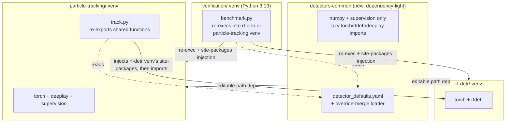

# refactor: Consolidate verification/ and particle-tracking/ detector plumbing

## Summary

Extract the detector-loading and detection code duplicated between `particle-tracking/track.py` and `verification/benchmark.py` into a new shared package, and back both tools' detector parameters (checkpoint, threshold, tiling, NMS) with one canonical defaults source instead of two independently hand-maintained copies. CLI flag naming aligns between the two tools; they remain separate, purpose-built entrypoints.

## Problem Frame

`verification/` (synthetic-data benchmarking) and `particle-tracking/` (real-footage tracking) both load RF-DETR and LodeSTAR, but evolved independently with separate venvs, separate config schemas, and duplicated model-loading code. `verification/benchmark.py` inlines its own copies of `particle-tracking/track.py`'s `get_rfdetr_model`, `get_lodestar_model`, `detect_lodestar`, and tiling/NMS logic — deliberately, to avoid importing `track.py`'s module-level setup code and to keep independent cross-venv re-exec routing. That duplication let the two copies' config values silently drift: `verification/config.yaml`'s `benchmark.lodestar.nms_distance` was `null` (NMS disabled) while every production `particle-tracking` config already used `nms_distance: 30`, and this session's benchmark comparison was the first thing to surface it. Research for this plan found the duplication has also let the *code* itself drift, not just config: `verification/benchmark.py`'s tiling helper is missing a bounds guard `particle-tracking/track.py`'s has, and `verification/benchmark.py`'s `get_rfdetr_model` is missing `num_classes` support and a class-lookup guard that `particle-tracking/track.py`'s has. This plan removes the duplication at its root rather than patching individual drifted values.

---

## Requirements

**Shared detector logic**

- R1. A new shared package provides `get_rfdetr_model`, `get_lodestar_model`, `detect_lodestar`, `detect_with_tiling`, `_normalize_device`, and `RFDETR_VARIANTS` as the single implementation both `rf-detr/.venv` and `particle-tracking/.venv` consume.
- R2. The shared package declares no `torch`/`rfdetr`/`deeplay` dependency of its own; those imports stay lazy and function-local, exactly as they are today in both existing copies.
- R3. `get_lodestar_model` supports both its genuine native-import caller (`particle-tracking`, where `deeplay`/`torch` are already installed) and its cross-venv-injection caller (`verification`) through one parametrized implementation, not two. `get_rfdetr_model` takes the target venv's site-packages path as a parameter rather than hardcoding it, since both existing callers always inject today (`rfdetr` only ever lives in `rf-detr/.venv`) — there is no real "native" case for this loader to preserve, only a generalized injection target.
- R4. The shared `detect_with_tiling` adopts `particle-tracking`'s bounds-guarded `tile_starts`, fixing the dormant negative-index bug in `verification`'s copy.
- R5. `get_rfdetr_model` carries `particle-tracking`'s `num_classes` parameter and its `None`-guarded class lookup, both currently missing from `verification`'s copy.

**Shared config defaults**

- R6. A new canonical defaults file captures today's already-converged production values (e.g. LodeSTAR `nms_distance: 30`, `alpha: 0.9`) as the default source both tools' config loaders merge against.
- R7. Loading a tool's own `config.yaml` at runtime layers its explicit keys over the shared defaults in memory; no `config.yaml` is rewritten to disk, so no comment-preservation problem is introduced.
- R8. Known unresolved value splits (LodeSTAR `fp16`, RF-DETR `tile_size`) are preserved as explicit per-tool overrides, not silently converged.

**CLI alignment**

- R9. `--device` and shared detector-flag help text and default-resolution logic read identically between `benchmark.py` and `track.py`.
- R10. `verification/benchmark.py`'s `--config` default resolves relative to the script's own directory, matching `particle-tracking/track.py`'s `SCRIPT_DIR` anchoring, instead of a bare cwd-relative string.

**Test coverage**

- R11. The shared package ships its own pytest suite exercising the moved functions directly, with plain imports and no `sys.path` hacks.
- R12. Existing test suites for both consumers keep passing with their mocking patterns preserved via local re-exports rather than call-site rewrites.

---

## Key Technical Decisions

- **Path dependency, not a `uv` workspace**: `rf-detr/`, `particle-tracking/`, and `yolov12/` each pin an independent CUDA-specific `torch`/`torchvision` build via their own `pytorch-cu130` index and are deliberately resolved/synced independently. A `uv` workspace forces one shared lockfile and one intersected resolution across all members — incompatible with that independence. `[tool.uv.sources]` path dependencies (`{ path = "../detectors-common", editable = true }`) keep each consumer's own lockfile and venv untouched otherwise.
- **The shared package stays dependency-light** (`numpy` + `supervision` only, both already present in every consumer venv). Declaring `torch`/`rfdetr`/`deeplay` there would pull CUDA-specific resolution into every consumer's lock, reintroducing the version-conflict risk the separate venvs exist to avoid.
- **Config merge happens in memory, never rewrites a file.** The shared loader merges the canonical defaults with a tool's own parsed `config.yaml` dict at runtime and returns the merged dict; it never writes back to `config.yaml`. This sidesteps the comment-preserving-YAML-merge problem `calibrate_psf.py --merge-config` already solved for a different (write-back) use case — that machinery isn't needed here.
- **Consumers re-export moved functions under their existing local names** rather than calling `detectors_common.get_rfdetr_model(...)` inline. Both existing test suites patch these functions as attributes of the consumer module (`monkeypatch.setattr(track, "get_rfdetr_model", ...)`, `mock.patch.object(benchmark, "get_lodestar_model", ...)`) — this is the standard "patch where it's used, not where it's defined" idiom, not a compatibility workaround, so keeping it is correct on its own merits, not just for test convenience.
- **`particle-tracking/track.py` and `verification/benchmark.py` re-export differently, because only one of them has `detectors-common` installed.** `track.py` imports `from detectors_common.rfdetr_loader import get_rfdetr_model` at module scope — safe, since `particle-tracking/.venv` always has `detectors-common` installed. `benchmark.py` cannot do the same: `verification/`'s own venv never installs `detectors-common` (it only becomes reachable after `benchmark.py`'s existing re-exec lands in `rf-detr/.venv` or `particle-tracking/.venv`), and `verification/tests/test_benchmark.py` does a plain `import benchmark` to avoid triggering that re-exec during test collection — a module-scope `detectors_common` import would make every test fail with `ModuleNotFoundError` before a single test runs. `benchmark.py` instead defines a thin wrapper per function (e.g. `def get_rfdetr_model(*a, **kw): from detectors_common.rfdetr_loader import get_rfdetr_model as _impl; return _impl(*a, **kw)`), importing `detectors_common` only inside the wrapper body — mirroring the lazy-import convention `benchmark.py` already uses for `torch`/`rfdetr`/`deeplay` themselves. `mock.patch.object(benchmark, "get_rfdetr_model", ...)` replaces the wrapper entirely, so the lazy import inside it never executes during tests.
- **Where the two existing copies differ and one is strictly more correct, adopt that one** rather than inventing a third version: `particle-tracking`'s `get_rfdetr_model` (has `num_classes` + a `None`-guarded class lookup) and `tile_starts` (has the bounds guard) become the shared implementation; `verification`'s copies of those two are retired, not merged piecemeal.
- **Site-packages injection is generalized via a parameter, with each loader's actual duality respected rather than assumed symmetric.** `get_lodestar_model` genuinely has two production call shapes today — `particle-tracking` imports `deeplay`/`torch` natively (no injection), `verification` injects a venv's site-packages first — so it keeps an `inject_venv_site_packages=None`-vs-path parameter, one implementation instead of two. `get_rfdetr_model` has no real "native" caller today (`rfdetr` only ever lives in `rf-detr/.venv`; both `track.py` and `benchmark.py` already inject that path unconditionally), so it takes the venv path as a required parameter rather than an optional one defaulting to a case that never occurs in production — this keeps the generalization honest instead of implying a duality that isn't there.
- **`detectors-common` stays narrow: detector loading + tiling + config-merge primitives only.** As more consumers or model types are added later, the temptation to fold in tracking-linkage logic, MLflow helpers, or other pipeline-stage code into this package (because "it's already shared") must be resisted — that would blur it from a narrow, dependency-light utility into a general-purpose grab-bag and undermine R2's "safe to install into any CUDA-sensitive venv" property. This constraint, plus the "always re-export under local names, never call `detectors_common.x(...)` qualified" convention, is documented in `detectors-common`'s own README so it survives contact with a future contributor who never read this plan.
- **The config-merge function stays schema-agnostic** — a generic recursive dict merge with zero model-type-specific branching. Adding a new detector type's config shape must never require editing the merge logic itself, only adding to `detector_defaults.yaml`; this is treated as a hard invariant, not an implementation detail, so `defaults.py` doesn't become the one file every new detector type has to modify.
- **`fp16` and `tile_size` value convergence is out of scope for this plan.** Research surfaced these as currently split (LodeSTAR `fp16` is `true` everywhere in `particle-tracking` but `false` in `verification`; RF-DETR `tile_size` has three different values across the repo). Per explicit decision, this plan builds the shared-defaults mechanism only and preserves today's values as-is; picking canonical values is deferred (see Scope Boundaries). Known-divergent keys are either omitted from `detector_defaults.yaml` entirely or included with an inline comment marking them non-canonical — never present as a bare value that could be mistaken for an endorsed default in the one file whose purpose is to stop that exact kind of silent drift.
- **The config merge uses an explicit per-consumer key-path mapping, not one shared literal tree shape.** `particle-tracking/config.yaml` nests detector parameters by pipeline concern (`model.*`, `detection.*`, `tiling.*`); `verification/config.yaml` nests them by tool and model type (`benchmark.lodestar.*`, `benchmark.tiling.*`). A single recursive merge against one canonical tree can't line up with both layouts at once. `detector_defaults.yaml` stays keyed by pure concept (e.g. `rfdetr.threshold`, `lodestar.nms_distance`); each consumer supplies its own small key-path mapping table describing where those concepts already live in its own config tree, and `load_detector_config` reads through the mapping rather than assuming structural equivalence. `particle-tracking`'s other config variants (`basic_config.yaml`, `multi_config.yaml`, `lodestar_config.yaml`, etc.) share one mapping, since they differ only in values, not in key layout — only `verification` needs a distinct mapping.
- **Choosing a shared package over making `track.py` directly importable.** An alternative to extraction would be guarding `track.py`'s module-level setup code (the reason `benchmark.py` inlines copies instead of importing it today) so `verification` could import `track.py` directly. That would still couple `verification` to `particle-tracking`'s full CLI script — its own argparse surface, tracking-linkage code, and config-loading assumptions — rather than a minimal, dependency-light surface, and wouldn't resolve the config-defaults duplication (R6-R8) either way. A small purpose-built shared package is a narrower, more stable coupling surface than the full production script.
- **No unified CLI entrypoint.** `benchmark.py` (synthetic ground-truth evaluation) and `track.py` (real-footage production tracking) stay two separate tools. Only flag naming/semantics align; merging them into one `detect`-style command would conflate a dev/CI tool with a production pipeline tool for no benefit to the actual pain point being fixed here.

---

## High-Level Technical Design



`detectors-common` is installed editable into both `rf-detr/.venv` and `particle-tracking/.venv`. `verification/`'s own venv never installs it directly — `benchmark.py` keeps its existing re-exec into whichever consumer venv the requested `--model-type` needs, and that venv's already-installed `detectors-common` becomes available once the re-exec lands.

---

## Output Structure

```
detectors-common/
├── pyproject.toml
├── README.md                    # scope guard + re-export convention, see U1
├── detectors_common/
│   ├── __init__.py
│   ├── rfdetr_loader.py         # get_rfdetr_model, RFDETR_VARIANTS, _normalize_device
│   ├── lodestar_loader.py       # get_lodestar_model, detect_lodestar
│   ├── tiling.py                # detect_with_tiling, tile_starts
│   ├── defaults.py              # load_detector_config: defaults + key-path-mapped override merge
│   └── detector_defaults.yaml
└── tests/
    ├── test_rfdetr_loader.py
    ├── test_lodestar_loader.py
    ├── test_tiling.py
    └── test_defaults.py
```

A flat single-level package: four source modules plus one data file don't justify a two-tier `loading/`+`config/` subpackage split — the conceptual distinction (inference-facing code that lazily touches `torch`/`rfdetr`/`deeplay` vs. `defaults.py`'s zero-framework-dependency config-merge logic) is documented in `detectors-common/README.md` instead of encoded as directory nesting.

---

## Scope Boundaries

**In scope, but distinct from the three confirmed consolidation directions**

- R4 and R5 — adopting `particle-tracking`'s bounds-guarded `tile_starts` and its more-complete `get_rfdetr_model` (`num_classes`, guarded class lookup) — are correctness fixes research surfaced during this plan, not part of the originally-confirmed "extract shared code / shared config defaults / align CLI flags" scope. They're included because a clean extraction needs to pick one implementation per function, and the more-correct one is the obvious pick; called out here explicitly rather than left to hide inside "extraction."

**Deferred to Follow-Up Work**

- Swapping `render.py`'s LAMMPS trajectory from `central_pair_interaction` to `continuous_force_test` — raised separately, explicitly deferred by the user.
- Converging LodeSTAR `fp16` and RF-DETR `tile_size` to single canonical values across all configs — this plan builds the override-merge mechanism only; picking the values is a detector-tuning decision, not an architecture one.
- Reconciling `particle-tracking/tracker_configs.py`'s own independent RF-DETR `tile_size` default (`800`) with the new shared defaults — a third value source discovered during research, but `tracker_configs.py` is internal to `particle-tracking` and outside the verification↔particle-tracking boundary this plan targets.
- A unified single CLI entrypoint spanning both tools — an intentional non-goal (see Key Technical Decisions), not a deferred item.

---

## Phased Delivery

- **Validate the `uv` path-dependency mechanism empirically before building out the full plan.** This repo has no existing precedent for a shared package installed via editable path dependency across independently-locked projects, and the design is grounded in `uv`'s own docs rather than tested against this repo's `pytorch-cu130` custom index. U1 and U5 should land and be verified first, in isolation, before starting U2-U4 or U6-U8 — if `uv add --editable` behaves unexpectedly here, it's cheaper to discover that with an empty package than after several units of logic depend on it.
- **Land as three PRs, not one:** (1) U1-U5 — package scaffold, moved detector-loading/tiling logic, and consumer wiring; (2) U6 — the config-defaults mechanism; (3) U7-U8 — CLI flag alignment and the consumer test migration. This keeps the riskiest, most novel piece (the shared package and its wiring) reviewable on its own before the config-merge and CLI-alignment units layer on top of it.

---

## Implementation Units

### U1. Scaffold the `detectors-common` package

**Goal:** Create the package skeleton — dependency-light, no CUDA index, flat single-level layout, and a README documenting the conventions a future contributor won't otherwise know to follow.

**Requirements:** R1, R2

**Dependencies:** none

**Files:** `detectors-common/pyproject.toml`, `detectors-common/detectors_common/__init__.py`, `detectors-common/README.md`

**Approach:** `requires-python = ">=3.11"`; `[project.dependencies]` limited to `numpy` and `supervision` (both already present in every consumer venv); `[build-system]` uses `hatchling` with `[tool.hatch.build.targets.wheel] packages = ["detectors_common"]`. No `[[tool.uv.index]]` entry and no `torch`/`rfdetr`/`deeplay` anywhere in this file. `README.md` states three conventions explicitly, since this plan document won't be discoverable to whoever adds a third consumer later: (1) consumers always re-export moved functions under their original local names and call them unqualified — never `detectors_common.x(...)` inline — to keep the module-attribute-patching test convention working; (2) `particle-tracking/track.py` re-exports at module scope (its venv has `detectors-common` installed), while `verification/benchmark.py` must re-export via a thin lazy-import wrapper per function (its venv never installs `detectors-common` — see Key Technical Decisions); (3) this package stays scoped to detector loading, tiling, and config-merge primitives only — pipeline-stage logic (tracking linkage, MLflow, etc.) belongs elsewhere even once a shared package exists to tempt otherwise.

**Patterns to follow:** `verification/pyproject.toml` (existing `hatchling`-based flat-layout precedent in this repo, adapted here into an importable package since it must be `import`-able by name from other projects' venvs).

**Test scenarios:** Test expectation: none — pure scaffolding, no behavior yet.

**Verification:** `uv sync` inside `detectors-common/` succeeds and installs only `numpy`/`supervision`.

**Execution note:** Land and verify U1+U5 together first, in isolation from U2-U4/U6-U8 — see Phased Delivery. This validates the novel `uv` editable-path-dependency mechanism against this repo's actual `pytorch-cu130` index before other units build on top of it.

### U2. Move device/variant helpers and `get_rfdetr_model`

**Goal:** Relocate `_normalize_device`, `RFDETR_VARIANTS`, and `get_rfdetr_model` into `detectors-common/detectors_common/rfdetr_loader.py`, adopting `particle-tracking`'s `num_classes` parameter and `None`-guarded class lookup, and generalizing the site-packages injection target into a required parameter (not an optional one defaulting to a "native" case that doesn't exist for this loader today — both current callers always inject `rf-detr/.venv`'s site-packages, since `rfdetr` never lives anywhere else).

**Requirements:** R1, R3, R5

**Dependencies:** U1

**Files:** `detectors-common/detectors_common/rfdetr_loader.py` (new), `particle-tracking/track.py` (remove local copy, re-export), `verification/benchmark.py` (remove local copy, re-export via lazy wrapper — see U5)

**Approach:** `get_rfdetr_model(variant, checkpoint, device, venv_site_packages_dir, num_classes=None, num_queries=None)` — the venv path is a required argument both existing callers already have available (`track.py` hardcodes `rf-detr/.venv`; `benchmark.py` resolves it via `_MODEL_VENV_DIRS`), not an optional default masking a call shape that never occurs in production. Class lookup uses `getattr(_rfdetr, cls_name, None)` with the clean error + `sys.exit(1)` `particle-tracking` already has, not `verification`'s unguarded `getattr`. If the resolved `venv_site_packages_dir` yields no `site-packages` glob match, raise a distinct, clearly-worded error (not the generic "rfdetr not found, run uv sync" catch) — a stale/wrong venv path is a different failure than a missing package install and should say so.

**Patterns to follow:** `particle-tracking/track.py`'s `get_rfdetr_model` (more complete implementation to adopt); `verification/benchmark.py`'s site-packages injection style (to generalize into the required-parameter form).

**Test scenarios:**
- Happy path: given a valid venv path, loads a model with `num_classes` threaded through to the constructor kwargs.
- Happy path: given a valid venv path, prepends site-packages and evicts `torch`/`torchvision` before import.
- Edge case: unknown variant name produces the same clean error + `sys.exit(1)` as `particle-tracking`'s version, not a raw `AttributeError`.
- Error path: a venv path with no matching `site-packages` directory (stale/renamed/never-synced venv) raises a distinct "venv not found or not synced" error rather than silently falling through to whatever's already on `sys.path`.

**Verification:** New tests in `detectors-common`'s own suite cover the happy paths and the unresolvable-venv-path error; both consumers' existing tests pass after re-export.

### U3. Move LodeSTAR loading and detection

**Goal:** Relocate `get_lodestar_model` and `detect_lodestar` into `detectors-common/detectors_common/lodestar_loader.py`. Unlike the RF-DETR loader, this one has a genuine native-vs-inject duality in production today (`particle-tracking` imports `deeplay`/`torch` directly; `verification` injects a venv's site-packages first), so it keeps an optional parameter for it while preserving the per-model-type eviction set and the "only evict if we actually injected" guard.

**Requirements:** R1, R3

**Dependencies:** U1

**Files:** `detectors-common/detectors_common/lodestar_loader.py` (new), `particle-tracking/track.py`, `verification/benchmark.py` (lazy wrapper — see U5)

**Approach:** `get_lodestar_model(checkpoint, device, inject_venv_site_packages=None, fp16=False)` — `None` is `particle-tracking`'s real native-import case; a path is `verification`'s real cross-venv case. Eviction set for LodeSTAR mode is `{torch, torchvision, supervision, deeplay}`, applied only when this call actually performed the injection (not unconditionally). If a given `inject_venv_site_packages` path yields no `site-packages` glob match, raise a distinct "venv not found or not synced" error rather than silently falling through to whatever's already on `sys.path`.

**Patterns to follow:** `verification/benchmark.py`'s existing `get_lodestar_model` (already has the injection+eviction-guard logic to generalize); `particle-tracking/track.py`'s native case becomes the `inject_venv_site_packages=None` branch.

**Test scenarios:**
- Happy path: native mode (`inject_venv_site_packages=None`) loads via direct import with no site-packages manipulation.
- Happy path: cross-venv mode injects site-packages once and evicts the four-module set only on that first injection.
- Edge case: a second call after injection already happened for that path does not re-evict.
- Error path: an `inject_venv_site_packages` path with no matching `site-packages` directory raises the distinct venv-not-found error rather than silently proceeding.
- Integration: `detect_lodestar`'s sigma-to-pixel scaling and NMS behavior is unchanged (the two existing copies were already functionally identical, differing only in docstring/comment text).

**Verification:** The existing sigma-scaling/NMS/empty-detection test scenarios (currently in `verification/tests/test_benchmark.py`'s `TestGetLodestarModel`/`TestDetectLodestar`) pass unchanged against the shared implementation; a new test covers the unresolvable-venv-path error path.

### U4. Move tiling+NMS merge logic, fixing the dormant bounds bug

**Goal:** Relocate `detect_with_tiling` into `detectors-common` using `particle-tracking`'s bounds-guarded `tile_starts`.

**Requirements:** R1, R4

**Dependencies:** U1, U2

**Files:** `detectors-common/detectors_common/tiling.py` (new), `particle-tracking/track.py`, `verification/benchmark.py` (lazy wrapper — see U5)

**Approach:** Single `tile_starts` implementation carrying the `if length <= tile_size: return [0]` guard that `verification`'s copy is missing; `detect_with_tiling` otherwise unchanged (per-tile `predict` + NMS merge).

**Patterns to follow:** `particle-tracking/track.py`'s `tile_starts` (the correct version).

**Test scenarios:**
- Happy path: a frame smaller than `tile_size` in both dimensions bypasses tiling entirely (existing behavior, regression guard).
- Edge case: a frame smaller than `tile_size` in exactly one dimension — the bug case — verifies `tile_starts` returns `[0]` for that dimension instead of a negative start index.
- Happy path: a frame larger than `tile_size` in both dimensions produces overlapping tiles merged via NMS, matching today's proven behavior.

**Verification:** A new test reproducing the one-dimension-smaller case (previously untested, since `verification`'s synthetic frames always equaled `tile_size` exactly) fails against the retired code path and passes against the shared implementation.

### U5. Wire `rf-detr/` and `particle-tracking/` as `detectors-common` consumers

**Goal:** Add `detectors-common` as an editable path dependency to both consumer projects, and re-export the moved functions under their original local names — using two different re-export shapes, since only one consumer's venv actually has `detectors-common` installed.

**Requirements:** R1, R3, R12

**Dependencies:** U2, U3, U4

**Files:** `rf-detr/pyproject.toml`, `particle-tracking/pyproject.toml`, `particle-tracking/track.py`, `verification/benchmark.py`

**Approach:** `uv add --editable ../detectors-common` from within `rf-detr/` and `particle-tracking/`, which writes both the dependency entry and the `[tool.uv.sources]` block (`verification/pyproject.toml` is untouched — its venv never installs `detectors-common`). In `particle-tracking/track.py`, import at module scope under the existing bare names (e.g. `from detectors_common.rfdetr_loader import get_rfdetr_model`) — safe, since `particle-tracking/.venv` always has `detectors-common` installed. In `verification/benchmark.py`, a module-scope import is unsafe: `verification/tests/test_benchmark.py` does a plain `import benchmark` to avoid triggering the existing cross-venv re-exec during test collection, and that happens under `verification/`'s own venv where `detectors-common` is never installed — a top-level `detectors_common` import there would fail every test at collection. Instead, `benchmark.py` defines a thin wrapper per function that imports `detectors_common` inside the wrapper body (e.g. `def get_rfdetr_model(*a, **kw): from detectors_common.rfdetr_loader import get_rfdetr_model as _impl; return _impl(*a, **kw)`), mirroring the lazy-import convention `benchmark.py` already uses for `torch`/`rfdetr`/`deeplay` themselves — the import only ever executes after `benchmark.py`'s own re-exec has already landed in a venv where `detectors-common` is installed, or inside a test that leaves the wrapper unmocked (which none should).

**Patterns to follow:** `[tool.uv.sources]` path/editable syntax confirmed against current `uv` docs (`{ path = "../detectors-common", editable = true }`; `editable = true` is not the default and must be explicit). `benchmark.py`'s own existing lazy-import-inside-function-body convention (already used for `torch`/`rfdetr`/`deeplay`) is the pattern the wrapper functions extend to `detectors_common` itself.

**Test scenarios:**
- Happy path: `uv sync` in `rf-detr/` and `particle-tracking/` resolves `detectors-common` without pulling any new heavy transitive dependency.
- Integration: existing `particle-tracking/tests/test_track.py` and `verification/tests/test_benchmark.py` suites pass unmodified against the re-exported names.
- Regression: `import benchmark` succeeds under `verification/`'s own venv with no `detectors-common` installed at all (proving the wrapper functions never import it at module scope) — this is the direct regression guard for the bug this design avoids.

**Verification:** `uv run pytest` is green in `particle-tracking/` and `verification/` after wiring; `uv sync` output confirms `detectors-common` resolves from the local path, not a registry; `python -c "import benchmark"` succeeds when run under `verification/.venv` alone (no `rf-detr/.venv` or `particle-tracking/.venv` site-packages on `sys.path`).

### U6. Shared detector defaults + runtime override-merge loader

**Goal:** Add a canonical `detector_defaults.yaml` capturing today's already-converged values, plus a loader that merges a tool's own `config.yaml` over those defaults in memory.

**Requirements:** R6, R7, R8

**Dependencies:** U1

**Files:** `detectors-common/detectors_common/detector_defaults.yaml` (new), `detectors-common/detectors_common/defaults.py` (new), `particle-tracking/track.py` (config reads consult the merged config), `verification/benchmark.py` (config reads consult the merged config)

**Approach:** `detector_defaults.yaml` is keyed by pure concept (e.g. `rfdetr.threshold`, `lodestar.nms_distance`, `lodestar.alpha`), not by either tool's own nesting shape — `particle-tracking/config.yaml` nests by pipeline concern (`model.*`, `detection.*`, `tiling.*`) while `verification/config.yaml` nests by tool and model type (`benchmark.lodestar.*`, `benchmark.tiling.*`), and a single recursive merge can't line up with both at once. `load_detector_config(model_type, tool_config_dict, key_path_map) -> merged_dict` takes each caller's own small mapping from canonical key to that tool's dotted config path (e.g. `particle-tracking` maps `lodestar.nms_distance -> detection.nms_distance`; `verification` maps `lodestar.nms_distance -> benchmark.lodestar.nms_distance`), reads through the mapping, and returns the merged effective values — override wins wherever the tool config actually sets that path, otherwise the canonical default applies. `particle-tracking`'s other config variants (`basic_config.yaml`, `multi_config.yaml`, `lodestar_config.yaml`, etc.) share one mapping table, since they differ only in values, not key layout. The defaults file is located via the installed package's own path (e.g. relative to `defaults.py`'s `__file__`), not a path relative to the caller's cwd. Nothing is ever written back to a `config.yaml` file. Known-divergent keys (`fp16`, `tile_size`) are either omitted from `detector_defaults.yaml` or included with an inline comment marking them non-canonical, never as a bare value that could be mistaken for an endorsed default. The merge function itself stays a generic recursive lookup with zero model-type-specific branching — adding a new detector type must only ever require adding to `detector_defaults.yaml` and a mapping entry, never editing `defaults.py`'s own logic; this is a hard invariant, not an implementation detail.

**Patterns to follow:** the existing dotted-path `_cfg_get` helper already present in both `track.py` and `benchmark.py`, as the read-side convention to preserve on top of the merge.

**Test scenarios:**
- Happy path: a tool config with no override for a mapped key falls back to the shared default value.
- Happy path: a tool config that explicitly sets a mapped key (e.g. `detection.nms_distance: 30` for `particle-tracking`, `benchmark.lodestar.nms_distance: 30` for `verification`) keeps its own value even where the shared default agrees or disagrees.
- Edge case: the same canonical key resolves correctly through two structurally different mappings (`particle-tracking`'s `detection.*` vs. `verification`'s `benchmark.lodestar.*`) without either tool's config needing to change shape.
- Regression: `fp16` and `tile_size` retain their currently-divergent per-tool values after merging (per R8 — not converged by this unit), and are never rendered as a bare canonical value in `detector_defaults.yaml`.

**Verification:** Existing config-driven tests in both consumers resolve to the same effective values as before the merge loader was introduced, except where a value was previously silently defaulted in Python code and now comes from `detector_defaults.yaml` instead (same value, new source).

### U7. Align CLI flag naming and defaults between `benchmark.py` and `track.py`

**Goal:** Make `--device` help text/resolution logic and `--config` path anchoring consistent between the two tools.

**Requirements:** R9, R10

**Dependencies:** U5, U6

**Files:** `verification/benchmark.py`, `particle-tracking/track.py`

**Approach:** `benchmark.py`'s `--config` default switches from the bare `"config.yaml"` string to a `SCRIPT_DIR`-anchored path, matching `track.py`. `--device` help text and default-resolution order become textually identical between the two `argparse` definitions.

**Patterns to follow:** `particle-tracking/track.py`'s `SCRIPT_DIR`-anchored `--config` default.

**Test scenarios:**
- Happy path: running `benchmark.py` from a different cwd than `verification/` still finds `config.yaml` (regression guard for the `_resolve_model_type` pre-parse / real-parse agreement already noted in `benchmark.py`'s own comments).
- Happy path: `--device` help text matches between `benchmark.py --help` and `track.py --help`.

**Verification:** Manual `--help` diff between the two tools shows aligned flag descriptions; existing cwd-relative-config tests still pass.

### U8. `detectors-common` test suite and consumer test migration

**Goal:** Give `detectors-common` its own pytest suite; update the two consumers' mocking to target the shared package where the moved functions now live.

**Requirements:** R11, R12

**Dependencies:** U2, U3, U4, U5

**Files:** `detectors-common/tests/` (new), `verification/tests/test_benchmark.py`, `particle-tracking/tests/test_track.py`

**Approach:** `detectors-common`'s own suite imports plainly (`import detectors_common...`, no `sys.path` hacks, since it's a real installed editable package). Existing consumer tests keep their current `monkeypatch.setattr(track, "get_rfdetr_model", ...)` / `mock.patch.object(benchmark, "get_lodestar_model", ...)` patterns unchanged, since U5's re-export keeps the same local names — this is the standard "patch where it's used, not where it's defined" idiom, not a compatibility workaround; only the `sys.modules["deeplay"]`/`["torch"]`-level mocks need their target import path updated to the new module location. `track.py`'s re-export sites carry a one-line comment (`# re-exported from detectors_common.rfdetr_loader — edit there, not here`); `benchmark.py`'s wrapper functions carry the same note plus a comment explaining why they're wrappers, not direct imports (see U5).

**Patterns to follow:** `verification/tests/test_benchmark.py`'s `supervision`-before-mocked-`torch` import-order convention (real-import `supervision` before any test mocks `sys.modules["torch"]`) — this must carry into `detectors-common`'s own suite too, since it runs under both venvs' pytest.

**Test scenarios:**
- Happy path: `detectors-common`'s suite covers `get_rfdetr_model`, `get_lodestar_model`, `detect_lodestar`, and `detect_with_tiling` in both native and cross-venv-injection modes (consolidating U2-U4's test scenarios into the actual test files).
- Integration: `particle-tracking/tests/test_track.py` and `verification/tests/test_benchmark.py` full suites pass after migration, with changes limited to import-path/mock-target updates, not test logic.
- Regression: the existing `os.execv`-interception and `_MODEL_VENV_DIRS` redirection tests in `test_benchmark.py` (which verify the re-exec routing itself, not the moved functions) are unaffected, since that routing logic stays in `benchmark.py`.
- Regression: in `particle-tracking/tests/test_track.py`, an identity-check assertion (`assert track.get_rfdetr_model is detectors_common.rfdetr_loader.get_rfdetr_model`) fails loudly if `track.py`'s re-export is ever accidentally shadowed by a locally-defined function. `verification/benchmark.py`'s wrapper functions aren't the same object as the shared implementation by design, and `detectors_common` isn't importable at all under `verification/`'s own venv — even for test-patching purposes, `mock.patch.object` on a real `detectors_common` reference isn't available there — so their regression guard uses the same `mock.patch.dict(sys.modules, {"detectors_common.rfdetr_loader": fake_module})` technique the existing suite already uses for `deeplay`/`torch`, confirming the wrapper's lazy import resolves to and calls through to the faked module rather than reimplementing the logic inline.
- Regression: a lightweight static scan (grep or AST walk) over `track.py` and `benchmark.py` asserting no call site references `detectors_common.<module>.<name>(` qualified, outside the single import/wrapper-definition line — catching the case where the module-level re-export or wrapper stays intact but a separate call site bypasses it and silently escapes test mocks.

**Verification:** `uv run pytest tests/ -v` is green in `detectors-common/`, `particle-tracking/`, and `verification/`.

---

## System-Wide Impact

- **Every contributor with an existing local `rf-detr/.venv` or `particle-tracking/.venv` must re-run `uv sync`** after this lands, since both projects gain a new editable path dependency.
- **In-flight branches touching `track.py`'s or `benchmark.py`'s model-loading functions will conflict** and need rebasing against the re-exported names once this merges.
- **`verification/README.md` and `particle-tracking/README.md` both document today's duplicated/inlined setup** (the cross-venv `uv sync` instructions, the "why inlined not imported" rationale) — both need a short update pointing at `detectors-common` and its own one-time `uv add --editable` setup step.
- **No resolved-value behavior change for any existing config** — the merge (U6) is mechanism-only and the moved functions are either functionally identical (`detect_lodestar`) or adopt the already-more-correct existing implementation (`get_rfdetr_model`, `tile_starts`). The one intentional behavior change is U4's bounds-guard fix, which is dormant for every config in the repo today and only changes behavior for a future config where `tile_size` doesn't equal the frame size in exactly one dimension.

---

## Risks & Dependencies

- **`uv` lock staleness on shared-package dependency changes**: no confirmed automatic detection when `detectors-common/pyproject.toml` gains a new dependency without touching a consumer's own `pyproject.toml` (see [astral-sh/uv#18312](https://github.com/astral-sh/uv/issues/18312)). Treat any change to `detectors-common`'s own dependencies as requiring a manual `uv lock`/`uv sync` in both `rf-detr/` and `particle-tracking/`.
- **Editable path dependency ties the layout to this repo's on-disk structure** (`../detectors-common` relative paths). Acceptable since this is an intra-repo, never-published package.
- **Test migration touches two already-passing suites** (94 tests in `verification/` as of this session, plus `particle-tracking`'s own). The re-export approach (KTD) is what keeps this low-risk; deviating from it during implementation would require rewriting mock targets across both files.
- **U4's bug fix changes tiling behavior for a previously-untested input shape** (frame smaller than `tile_size` in exactly one dimension). Dormant today because `verification`'s synthetic frames have always equaled `tile_size` exactly, but any config that changes that relationship going forward now behaves correctly instead of silently corrupting via a negative-index slice.
- **U6's config merge must reproduce today's effective values exactly** for every existing config file — the point of this unit is a mechanism change, not a value change, so any resolved-value drift between old and new code is a regression, not the deferred value-convergence work.
- **The shared package's editable install depends on `numpy`/`supervision` version ranges already overlapping across `rf-detr/`, `particle-tracking/`, and `verification/`'s independently-resolved `pyproject.toml` files.** They currently do (`numpy>=1.26`, `supervision>=0.21` in all three), which is why `detectors-common` can declare those two dependencies without forcing a resolution conflict — but this is a load-bearing assumption, not something enforced by the plan's mechanism, and would need re-checking if any consumer's pin changes independently in the future.

---

## Sources & Research

- `particle-tracking/track.py:71-278` vs `verification/benchmark.py:114-318` — the duplicated-logic surface and every behavioral difference found between the two copies.
- `docs/plans/2026-07-16-002-feat-lodestar-verification-benchmark-plan.md` — documents why `get_lodestar_model`/`detect_lodestar` were inlined into `benchmark.py` rather than imported (avoiding `track.py`'s module-level setup code), and the model-type-aware re-exec/site-packages-injection design this plan must not disturb.
- `docs/plans/2026-07-16-001-fix-code-review-remediation-plan.md` (R9) — precedent for generating YAML via `yaml.safe_dump` on a built dict, never string-templated, and the prior deliberate rejection of `ruamel.yaml` for a narrower comment-preservation need (informs why this plan avoids that problem entirely rather than reopening it).
- `particle-tracking/tracker_configs.py` — a pre-existing, in-repo "canonical defaults + generator" precedent (scoped to one project, not cross-venv), and the source of the third RF-DETR `tile_size` value (`800`) noted in Scope Boundaries.
- `verification/tests/test_benchmark.py:20` — the `supervision`-before-mocked-`torch` import-order convention required to avoid stale-mock state across tests.
- [uv: Managing dependencies — path/editable sources](https://docs.astral.sh/uv/concepts/projects/dependencies/) — confirms `[tool.uv.sources]` syntax and that `editable = true` is not the default.
- [uv: Workspaces](https://docs.astral.sh/uv/concepts/projects/workspaces/) — confirms workspaces force one shared lockfile/resolution across members, motivating the path-dependency KTD over a workspace.
- [uv: Locking and syncing](https://docs.astral.sh/uv/concepts/projects/sync/) — confirms `uv run`/`uv sync` auto-lock behavior for ordinary dependency changes.
- [astral-sh/uv#18312](https://github.com/astral-sh/uv/issues/18312) — open caveat on lock staleness detection for local editable path dependencies.
