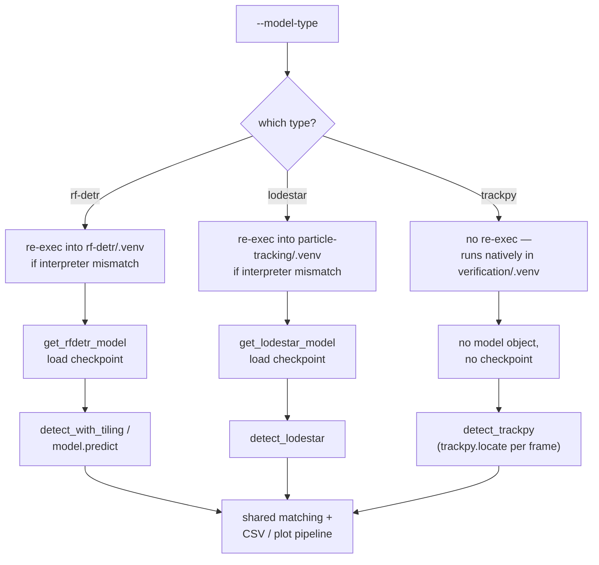

# feat: Add trackpy as a comparable detector in verification/benchmark.py

## Summary

Add trackpy's classical particle-localization algorithm (`trackpy.locate`) as a third `--model-type` in `verification/benchmark.py`, alongside the existing `rf-detr` and `lodestar` options, so the synthetic-frame benchmark can report precision/recall/F1/MOTA/IDF1 for a non-ML baseline detector on equal footing with the two learned models. Scoped strictly to the verification/comparison tool — `particle-tracking/track.py`'s production pipeline is unchanged.

---

## Problem Frame

`verification/benchmark.py` already benchmarks RF-DETR and LodeSTAR detection accuracy against synthetic ground truth, and `plot_benchmark.py` already anticipates comparing more than two model types (its `_MODEL_COLORS` fixed-order palette and unknown-model-type fallback logic exist for exactly this). Trackpy is already used throughout the repo, but only as the *linker* (`tp.link_df`, `tp.filter_stubs` in both `particle-tracking/track.py` and `benchmark.py`'s own tracking-metrics pass) — never as a *detector*. Trackpy ships its own classical brightness-thresholding particle-finding algorithm (`trackpy.locate`), which is a natural non-ML baseline to compare against RF-DETR and LodeSTAR, and the user has asked for exactly that comparison. Unlike the two existing model types, trackpy has no CUDA/compiled-extension dependency and is already a native dependency of `verification/pyproject.toml` (used today for the tracking-metrics pass) — it needs no cross-venv site-packages injection or subprocess re-exec, which is architecturally simpler than either existing model type's integration.

---

## Requirements

- R1. `verification/benchmark.py` supports `trackpy` as a third `--model-type` value (alongside `rf-detr`, `lodestar`), dispatched through the same per-frame detection loop and reported through the same precision/recall/F1/MOTA/IDF1 pipeline as the other two.
- R2. Trackpy detection runs natively in `verification/.venv` — no cross-venv site-packages injection and no subprocess re-exec, since `trackpy` has no CUDA/compiled-extension dependency and is already installed there.
- R3. `_MODEL_VENV_DIRS` remains the single source of truth for valid `--model-type` values (including `trackpy`), without introducing a second, parallel dispatch mechanism alongside it.
- R4. `main()` treats `trackpy` as a model type with no checkpoint file and no loaded model object — the existing `checkpoint.exists()` guard and "load model" step are skipped for it, not satisfied with a placeholder path.
- R5. `verification/config.yaml` gains a `benchmark.trackpy.*` block (`diameter`, `minmass`, `separation`), documented inline and read the same way `benchmark.lodestar.*` is read today.
- R6. `plot_benchmark.py` and `verification/README.md` are updated so a `trackpy` benchmark run's output is visualized and documented with the same parity as `rf-detr`/`lodestar`.
- R7. New/updated tests cover `detect_trackpy`, the re-exec skip for `trackpy`, and `main()`'s model-type dispatch for `trackpy`, following the existing test patterns in `verification/tests/test_benchmark.py`.

---

## Key Technical Decisions

- **trackpy detection logic lives directly in `benchmark.py`, not `detectors-common`.** `detectors-common` exists to share detector-loading code across *multiple* CUDA-sensitive consumer venvs while staying dependency-light (see `docs/plans/2026-07-17-001-refactor-consolidate-verification-particle-tracking-plan.md`). Trackpy has exactly one consumer today (`benchmark.py`, per confirmed scope) and no CUDA dependency to isolate — routing it through `detectors-common` would add indirection with no sharing benefit and blur that package's narrow scope for no reason.
- **`_MODEL_VENV_DIRS["trackpy"] = None` signals "run natively, skip re-exec."** `_reexec_for_model_venv` currently does `_MODEL_VENV_DIRS.get(model_type, _MODEL_VENV_DIRS["rf-detr"])` and unconditionally treats the result as a venv directory. Registering `trackpy` with a `None` value (rather than omitting it, which would silently fall through to the rf-detr venv default) keeps `_MODEL_VENV_DIRS`'s keys as the single source of truth for valid `--model-type` choices (`argparse`'s `choices=list(_MODEL_VENV_DIRS)` already reads from it) while making the "no venv needed" case explicit. `_reexec_for_model_venv` gets one early-return guard: `if venv_dir is None: return`.
- **`main()` special-cases `trackpy` with `checkpoint = None`.** The existing `if not checkpoint.exists(): sys.exit(1)` guard assumes every model type has a checkpoint path. Trackpy has no model weights, so its config-resolution branch sets `checkpoint = None` and the guard becomes `if checkpoint is not None and not checkpoint.exists(): ...` — this is a real absence, not a placeholder path that happens to exist.
- **`diameter`/`minmass`/`separation` are config-only, no new CLI flags.** `benchmark.py` today only exposes `--model-type`, `--device`, `--frames`, `--ground-truth`, `--ground-truth-tracks`, and `--config` as CLI flags — every other per-model parameter (`lodestar.alpha`, `lodestar.nms_distance`, `rf-detr.tiling.*`, etc.) is config-only. Trackpy's parameters follow the same convention rather than inventing a new CLI-flag precedent for one model type.
- **Trackpy's `mass` output is not surfaced as `.confidence`.** `sv.Detections.confidence` on the other two model types is a genuine 0–1 model probability; trackpy's `mass` is an unbounded integrated-brightness value with a different scale and meaning. Nothing in `benchmark.py`'s current matching or reporting path reads `.confidence` at all, so populating it with `mass` would add a field with no consumer and a misleading name. `detect_trackpy` leaves `confidence=None`; surfacing `mass` as a real diagnostic signal is deferred (see Scope Boundaries).
- **Diameter/minmass tuning is deferred; this plan wires the mechanism with a documented starting default only.** RF-DETR's and LodeSTAR's thresholds both required empirical sweeps against synthetic frames before landing on final values (see `docs/plans/2026-07-16-002-feat-lodestar-verification-benchmark-plan.md` and `verification/config.yaml`'s own threshold comments). Trackpy's `diameter`/`minmass` will need the same treatment; this plan ships a reasonable starting default (documented, not asserted as correct) and leaves the sweep for a follow-up run of `benchmark.py` itself, the same tool this plan is extending.

---

## High-Level Technical Design

`trackpy`'s path is shorter than the other two: no venv re-exec, no model-loading step, no checkpoint file. It rejoins the shared per-frame matching and CSV/plot pipeline at the same point the other two model types do, so every downstream consumer (`_match_detections`, `_run_tracking_metrics`, `plot_benchmark.py`) needs no changes beyond recognizing the new model-type string.

---

## Scope Boundaries

**Deferred to Follow-Up Work**

- Adding trackpy as a production `--model-type` in `particle-tracking/track.py` — explicitly out of scope per user decision; this plan touches `verification/` only.
- Empirical sweep of `diameter`/`minmass` against synthetic frames to find optimal values (analogous to the RF-DETR/LodeSTAR threshold sweeps already documented in this repo) — this plan wires the comparison mechanism and ships a documented starting default only.
- Surfacing trackpy's `mass` output as a genuine confidence/diagnostic signal for downstream consumers — no current consumer needs it (see Key Technical Decisions).
- Any other "improve the verification system" work beyond this addition — explicitly out of scope per user decision; this plan is scoped strictly to the trackpy comparison.

---

## Implementation Units

### U1. Add `detect_trackpy()` and the native-execution (no-re-exec) path

**Goal:** Implement the trackpy detection function and make `_MODEL_VENV_DIRS`/`_reexec_for_model_venv` treat `trackpy` as a model type that runs natively in `verification/.venv`, with no cross-venv injection and no subprocess re-exec.

**Requirements:** R1, R2, R3

**Dependencies:** none

**Files:** `verification/benchmark.py`, `verification/tests/test_benchmark.py`

**Approach:** Add `"trackpy": None` to `_MODEL_VENV_DIRS`, with the dict's docstring updated to explain that a `None` value means "no compiled dependency, run natively — skip re-exec." In `_reexec_for_model_venv`, add `if venv_dir is None: return` immediately after resolving `venv_dir`, before any filesystem access. Add `detect_trackpy(frame, diameter, minmass=None, separation=None)`: convert the RGB uint8 `frame` to a single-channel grayscale array (e.g. `frame.mean(axis=2)`), call `trackpy.locate(gray, diameter, minmass=minmass, separation=separation)`, and convert the returned DataFrame's `x`/`y` columns into an `sv.Detections` object with `xyxy` boxes of size `diameter` centered on each `(x, y)` and `confidence=None` (see Key Technical Decisions on why `mass` isn't surfaced as confidence). An empty trackpy result (no rows) returns `sv.Detections.empty()`, matching the other two detectors' empty-frame behavior.

**Patterns to follow:** `detect_lodestar`'s existing structure in `verification/benchmark.py` (frame in, `sv.Detections` out, box built from a configurable fallback size) as the shape to mirror for `detect_trackpy`; `TestReexecForModelVenv` in `verification/tests/test_benchmark.py` for the re-exec test pattern.

**Test scenarios:**
- Happy path: `detect_trackpy` on a synthetic grayscale-embeddable frame with one bright Gaussian blob at a known `(x, y)` returns one detection whose box center is within ~1px of the true position.
- Happy path: `detect_trackpy` on a frame with no bright features above `minmass` returns an empty `sv.Detections` (length 0), not an error.
- Edge case: `minmass=None` (unset) still runs successfully — `trackpy.locate`'s `minmass` defaults to `0` (no mass-based filtering), relying solely on its own `percentile`-based peak filter (default 64) rather than any minmass-specific adaptive threshold.
- Edge case: `"trackpy"` is present in `list(_MODEL_VENV_DIRS)`, so it is a valid `--model-type` argparse choice.
- Regression: `_reexec_for_model_venv("trackpy")` does not call `os.execv` (verifies the `None`-venv-dir skip path); `_reexec_for_model_venv("rf-detr")`'s existing behavior is unchanged.

**Verification:** New tests in `verification/tests/test_benchmark.py` cover the happy paths, the empty-detection case, and the re-exec skip; existing `TestReexecForModelVenv` tests for `rf-detr`/`lodestar` still pass unmodified.

**Execution note:** `detect_trackpy` is a small pure function with a clear input/output contract (frame + params in, detections out) — write its test cases (bright-blob detection, empty-frame case) before the implementation.

### U2. Wire `trackpy` into `main()`'s config resolution and detection dispatch

**Goal:** Make `main()` resolve trackpy's config block, skip checkpoint/model-loading for it, call `detect_trackpy` in the per-frame loop, and print run info that makes sense for a detector with no checkpoint.

**Requirements:** R1, R4

**Dependencies:** U1, U3

**Files:** `verification/benchmark.py`, `verification/tests/test_benchmark.py`

**Approach:** Extend the existing `if model_type == "lodestar": ... else: ...` config-resolution block into a three-way branch, adding `elif model_type == "trackpy":` that sets `checkpoint = None`, sets `device_raw = args.device` (this line is required — `device = _normalize_device(device_raw or "0")` executes unconditionally right after this block for every model type, so omitting it raises `NameError` on every `trackpy` run), and reads `diameter`, `minmass`, `separation` from `benchmark.trackpy.*` via `_cfg_get` (mirroring how `lodestar`'s block reads its own keys). Change the checkpoint guard to `if checkpoint is not None and not checkpoint.exists(): ...`. Extend the model-loading `if model_type == "lodestar": ... else: ...` block to a three-way branch with `elif model_type == "trackpy": model = None`. Extend the print block so trackpy prints its `diameter`/`minmass` instead of a checkpoint path, and reuses the existing "Tiling: n/a" line already used for `lodestar` (tiling doesn't apply to either non-tiled detector) — change that branch's condition to `if model_type in ("lodestar", "trackpy"): ... else: ...` rather than adding a third `elif`, since `tiling_enabled`/`tile_size` are only ever assigned in the `else` (rf-detr) branch of config resolution. In the per-frame detection dispatch, the new `elif model_type == "trackpy": dets = detect_trackpy(img_rgb, diameter=diameter, minmass=minmass, separation=separation)` branch **must** be inserted immediately after the `if model_type == "lodestar":` branch and before `elif tiling_enabled:` — `tiling_enabled` is never assigned on the trackpy code path (same reasoning as the print block above), so appending the trackpy branch after `elif tiling_enabled:` would evaluate that undefined name and raise `UnboundLocalError` on every trackpy run. No changes needed to `all_detections_by_frame` accumulation, `_match_detections`, or `_run_tracking_metrics` — all are already generic over model type.

**Patterns to follow:** The existing `lodestar` branch at every one of these four decision points in `verification/benchmark.py`'s `main()` (config resolution, checkpoint guard, model loading, detection dispatch) is the direct template for the new `trackpy` branch at each point.

**Test scenarios:**
- Happy path: `main()` with `--model-type trackpy` does not call `get_rfdetr_model` or `get_lodestar_model`, and does not require `checkpoint.exists()` to pass.
- Happy path: `main()` with `--model-type trackpy` calls `detect_trackpy` once per synthetic frame and accumulates `all_detections_by_frame` the same way the other two model types do.
- Integration: an end-to-end `main()` run with `--model-type trackpy` against a small synthetic frame set + `ground_truth.json` produces `accuracy_metrics_trackpy.csv` with the same column schema as `accuracy_metrics_rf-detr.csv`/`accuracy_metrics_lodestar.csv`.
- Regression: `main()` with `--model-type rf-detr` or `--model-type lodestar` is unchanged — checkpoint existence is still enforced and the corresponding model is still loaded.

**Verification:** `TestMainModelTypeWiring`-style tests in `verification/tests/test_benchmark.py` cover the trackpy branch at each of the four decision points; existing `rf-detr`/`lodestar` wiring tests pass unmodified.

### U3. Add `benchmark.trackpy.*` config block

**Goal:** Give trackpy its own documented config section, matching the shape and documentation style of `benchmark.lodestar.*`.

**Requirements:** R5

**Dependencies:** none

**Files:** `verification/config.yaml`

**Approach:** Add a `benchmark.trackpy` block with `diameter` (odd integer, trackpy's core size parameter — must be odd or `trackpy.locate` raises), `minmass` (minimum integrated brightness; `null` lets trackpy apply its own default), and `separation` (`null` lets trackpy default to `diameter + 1`). Document inline that `diameter` needs empirical tuning per scene (see Key Technical Decisions on the deferred sweep) and give a documented starting value rather than an unexplained number, following the same inline-rationale style already used for `benchmark.lodestar.nms_distance`/`.threshold` in this file.

**Patterns to follow:** The `benchmark.lodestar:` block in `verification/config.yaml` (lines 72–82) — same nesting depth, same inline-comment density explaining each value's meaning and provenance.

**Test scenarios:**
- Happy path: `benchmark.trackpy.*` keys resolve to their documented built-in defaults when absent from a minimal config dict, via the same `_cfg_get(..., default=...)` pattern already used for every other `benchmark.*` key in this file (no `detectors_common.load_detector_config` involvement — see Key Technical Decisions on why trackpy isn't routed through the shared cross-tool defaults mechanism, which exists for multi-consumer convergence that doesn't apply here).
- Edge case: an explicit `benchmark.trackpy.diameter` override in config wins over the built-in default.

**Verification:** Covered by U2's config-resolution tests reading a config dict with and without an explicit `benchmark.trackpy` block.

### U4. Add trackpy's color slot to `plot_benchmark.py`

**Goal:** Give `trackpy` a fixed, non-cycled color in the comparison plot, consistent with the existing `rf-detr`/`lodestar`/`yolo` slots.

**Requirements:** R6

**Dependencies:** U1 (trackpy must be a valid model type before its output is plottable)

**Files:** `verification/plot_benchmark.py`

**Approach:** Add `"trackpy": "#e87ba4"` (the first color in the file's own `fallback_slots` list) to `_MODEL_COLORS`, with a `# slot 3: pink` comment following the existing convention for `rf-detr`/`lodestar`/`yolo`. Note: `_MODEL_COLORS` currently skips from `lodestar` (slot 2) to `yolo` (slot 6) with no comment explaining slots 3–5; `plot_benchmark.py` is an uncommitted new file with no git history to consult, so no reservation for those slots is discoverable. Slot 3 is free to take.

**Patterns to follow:** The existing `_MODEL_COLORS` dict and its "fixed categorical order, never cycled/reassigned" comment in `verification/plot_benchmark.py`.

**Test scenarios:** Test expectation: none — a trivial, non-branching dict entry extending an existing fixed-order pattern; `plot_benchmark.py` has no existing test suite in this repo to extend.

**Verification:** Running `plot_benchmark.py` after a `trackpy` benchmark run shows a distinct, stable color for the `trackpy` series that does not shift on subsequent runs.

### U5. Document trackpy in `verification/README.md`

**Goal:** Update the Model Selection table and setup notes so `trackpy` has the same documentation parity as `rf-detr`/`lodestar`.

**Requirements:** R6

**Dependencies:** U1, U2, U3

**Files:** `verification/README.md`

**Approach:** Add a `trackpy` row to the Model Selection table (README lines ~146–150), noting: config keys read (`benchmark.trackpy.*`), venv required (none — runs natively in `verification/.venv`), and that it's a classical brightness-thresholding baseline rather than a learned model. Update the Options table's `--model-type` row (README line ~161, currently documented as accepting only "rf-detr or lodestar") to include `trackpy`. Add a `--model-type trackpy` example to the Step 2 usage block alongside the existing `rf-detr`/`lodestar` examples. Update the Setup section's venv-requirements note to clarify trackpy needs no sibling-project venv.

**Patterns to follow:** The existing `lodestar` row and its "Venv required" column value in the Model Selection table; the existing `--model-type lodestar` usage example block.

**Test scenarios:** Test expectation: none — documentation only.

**Verification:** README's Model Selection table and usage examples list all three model types with accurate venv/config-key information.

---

## Risks & Dependencies

- **`trackpy.locate`'s `diameter` must be an odd integer.** An even value raises at runtime inside `trackpy.locate` rather than being validated proactively by this plan's code — acceptable since trackpy's own error message already names the problem clearly, but worth knowing when picking a config value.
- **Trackpy's precision/recall may differ substantially from the two ML models on dense or noisy synthetic scenes**, since it's a classical brightness-thresholding method rather than a learned detector. This plan wires the comparison mechanism; it makes no claim about which detector "wins" on any given scene.
- **The `diameter`/`minmass` starting defaults are unvalidated against this repo's synthetic frames** until the deferred empirical sweep (see Scope Boundaries) runs — early `trackpy` benchmark results may look poor purely due to untuned parameters, not a mechanism defect.

---

## Sources & Research

- `verification/benchmark.py:40–79` (`_MODEL_VENV_DIRS`, `_resolve_model_type`) and `:82–97` (`_reexec_for_model_venv`) — the dispatch mechanism this plan extends.
- `verification/benchmark.py:156–189` (`get_lodestar_model`, `detect_lodestar`, `_load_lodestar_defaults`) — the direct pattern `detect_trackpy` and its config-reading mirror.
- `verification/benchmark.py:385–478` (`main()`'s config resolution, checkpoint guard, model loading, print block) — the four decision points U2 extends to a third branch.
- `verification/config.yaml:48–82` (`benchmark:` section) — the shape and documentation style `benchmark.trackpy.*` follows.
- `verification/plot_benchmark.py:19–23` (`_MODEL_COLORS`) — fixed-order color convention for the new `trackpy` slot.
- `verification/README.md:142–151` (Model Selection table) — documentation parity target.
- `verification/pyproject.toml` — confirms `trackpy>=0.6` is already a native dependency of `verification/`'s own venv (used today for the tracking-metrics pass), which is why no venv-injection machinery is needed for detection use.
- `verification/tests/test_benchmark.py` (`TestReexecForModelVenv`, `TestMainModelTypeWiring`, `TestGetLodestarModelWrapper`) — existing test patterns U1/U2's new tests follow.
- `docs/plans/2026-07-17-001-refactor-consolidate-verification-particle-tracking-plan.md` — establishes why `detectors-common` stays narrow/multi-consumer-only (informs the KTD to keep trackpy logic local to `benchmark.py`).
- `docs/plans/2026-07-16-002-feat-lodestar-verification-benchmark-plan.md` — precedent for empirical threshold sweeps on this benchmark tool, informing the deferred diameter/minmass tuning decision.
