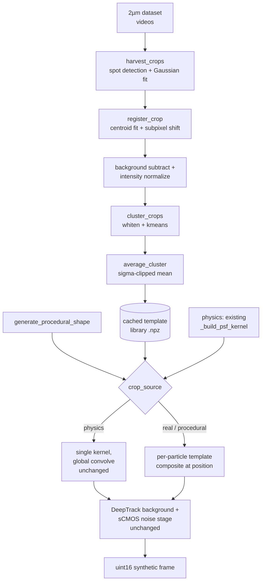

# feat: Crop-Based Particle Rendering

## Summary

Add a `crop_source` option (`physics` | `real` | `procedural`) to `verification/render.py`'s
DeepTrack strategy. `real` draws particle appearance from a small library of empirical PSF
templates built by harvesting, registering, and sigma-clipped-averaging real particle crops from
video frames; `procedural` draws from a parametric mathematical shape generator. Both composite
per-particle onto the canvas and flow through the existing DeepTrack background/sCMOS noise stage
unchanged; `physics` keeps today's behavior as the default.

---

## Problem Frame

`verification/render.py`'s synthetic frames — used by `verification/benchmark.py` to measure
detector/tracker accuracy — currently model particle appearance with parametric PSFs only (flat
Gaussian or DeepTrack2's physics-simulated diffraction kernel), which can't reproduce real
per-particle irregularity (shape asymmetry, texture, aggregates). See origin for the full problem
frame and motivation (this gap is suspected, not yet directly measured).

Research during planning found the two real crop folders the origin doc assumed as the template
source (`data-setup/models/lodestar_model_15/crops/`, `lodestar_model_10/crops/`) contain only 5
images each — too few to meaningfully cancel noise via averaging. This plan instead harvests real
crops via spot detection across full real video frames, using `verification/calibrate_psf.py`'s
existing `_detect_spots` (`verification/calibrate_psf.py:32`) as a starting point.

Doc review also found the video files under `particle-tracking/data/raw/` (`60% Intensity PS 5um
Video Trial 1.tif`, `70% Intensity PS 5um Video Trial 1_1_MMStack_Default.ome.tif`) depict **5 µm**
PS particles, not the 2 µm particles `verification/config.yaml`'s `lj_to_um: 2.0` and this feature's
own problem frame assume. Harvesting from the wrong particle size would render templates at the
wrong physical scale relative to the rest of the pipeline. This plan instead harvests from the
correctly-scaled 2 µm dataset already referenced by `particle-tracking/basic_config.yaml`,
`lodestar_config.yaml`, and `multi_lodestar_config.yaml`: multiple ~4.2GB videos under
`/mnt/d/Particle Tracking Data/2um-automatic-particle-detection-lodestar-data/`.

---

## Requirements

**Crop harvesting and template library**

- R1. `verification/` gains a module that harvests real particle crops via spot detection across
  real video frames from the 2 µm dataset (`/mnt/d/Particle Tracking Data/
  2um-automatic-particle-detection-lodestar-data/`, the same dataset `particle-tracking/`'s
  configs already use), not the existing LodeSTAR crop folders and not the 5 µm videos under
  `particle-tracking/data/raw/` (supersedes origin R2's assumption — see origin).
- R2. Harvested crops are sub-pixel registered and background/intensity-normalized before
  averaging, so template quality isn't degraded by mis-centered spots or photobleaching drift.
- R3. Registered crops are grouped into a small number of clusters (by measured size/intensity)
  and each cluster is combined via sigma-clipped mean averaging into one normalized template —
  never raw stamping of individual noisy crops.
- R4. The template library is built once and cached, not recomputed per rendered frame.

**Rendering integration**

- R5. `render.py`'s deeptrack strategy gains a configurable `crop_source` selecting between
  today's physics-simulated kernel, the empirical template library, or a procedural mathematical
  shape generator.
- R6. When `crop_source` is `real` or `procedural`, each particle's appearance is composited from
  an independently-sampled template/generated shape, not one shared kernel for the whole frame.
- R7. The existing DeepTrack background heterogeneity and sCMOS noise stage applies unchanged on
  top of the composited canvas, regardless of `crop_source`.
- R8. Rendered particle positions stay pixel-accurate against `ground_truth.json` /
  `ground_truth_tracks.csv`, matching the contract the physics/procedural/randomized strategies
  already satisfy.

**Validation**

- R9. `verification/compare_renders.py`'s realism metrics (SNR, radial PSD similarity) extend to
  cover `crop_source: real` and `crop_source: procedural`.
- R10. A warning fires if the video frames used to harvest real crop templates and the frame used
  for `compare_renders.py`'s realism comparison resolve to the same source file, to keep the
  comparison honest.

---

## Key Technical Decisions

- **Harvest crops via spot detection across the 2 µm real video dataset, not the LodeSTAR crop
  folders and not `particle-tracking/data/raw/`.** The existing crop folders hold only 5 images
  each — too few to cancel noise via averaging. `particle-tracking/data/raw/`'s videos are 5 µm
  particles — the wrong scale for this pipeline (`verification/config.yaml`'s `lj_to_um: 2.0`).
  The correctly-scaled source is the 2 µm dataset `particle-tracking/`'s own configs already
  reference: `/mnt/d/Particle Tracking Data/2um-automatic-particle-detection-lodestar-data/`.
  Supersedes the origin doc's "reuse existing crop libraries" decision.

- **Candidate detection via connected-component centroiding, not `calibrate_psf._detect_spots`
  (found during U1 implementation, confirmed against real data).** The original approach here
  called `calibrate_psf._detect_spots` (per-pixel `frame == maximum_filter(frame)` local-maxima
  detection) directly. Verified against the real 2 µm dataset (`2 um Lower Concentration/...
  20% Light Intensity_2...tif`, frame 0): up to ~4.5% of pixels sit at the sensor's saturation
  ceiling (4095, 12-bit). Every pixel inside such a plateau ties for "local max" under
  `_detect_spots`' equality test, producing 18,000–300,000+ spurious candidates per frame instead
  of one per real particle — computationally infeasible (each candidate triggers a
  `scipy.optimize.curve_fit` call) and semantically wrong. `render_crop_templates.py` instead adds
  a local `_detect_particle_centers(frame, min_area, max_area, percentile)`: threshold at a
  configurable percentile, label connected components (`scipy.ndimage.label`), filter by
  pixel-area, and take each surviving component's intensity-weighted centroid
  (`scipy.ndimage.center_of_mass`) as one candidate — robust to internal saturation regardless of
  plateau size. Real-data particles also measured far larger than the point-source assumption
  (`sigma` fitted 8–40px, vs. `calibrate_psf.py`'s `_DEFAULT_SIGMA = 5.0`), so `harvest_crops`'
  real-data call site uses `crop_half=20, min_sep=40, percentile=95.0, min_area=20, max_area=400`
  rather than point-source-scaled defaults — verified to yield 3310 usable crops from 5 frames of
  one video in ~32s, visually inspected as genuine bright-field particle images (bright disc with
  dark halo ring — exactly the real-world irregularity a Gaussian PSF can't reproduce). Does not
  modify `calibrate_psf.py` itself — that module's own calibration frames are apparently sparser
  and don't trigger this failure mode, and this plan makes no changes to it (see Scope Boundaries).

- **Load video frames lazily via per-page access, not whole-file `tifffile.imread`.** Each 2 µm
  video is ~4.2GB (300 frames × 2200×3200px × 2 bytes); mirroring `calibrate_psf._load_tifs`'s
  eager `tifffile.imread` (which loads and upcasts an entire file to float32 at once) across
  multiple such files risks tens of GB of resident memory. `harvest_crops` instead opens each
  video with `tifffile.TiffFile(...)` and reads pages lazily via `.pages[i].asarray()` — the same
  lazy-access pattern the (now-removed) `render_background_composite.py` used for these same raw
  videos.

- **Clustering via whitened features + `scipy.cluster.vq.kmeans`, not a new dependency.** `sigma`
  (O(1-10) px) and `peak_intensity` (O(10⁴) ADU) differ by orders of magnitude; unwhitened
  Euclidean k-means would cluster almost entirely on intensity, ignoring size. `cluster_crops`
  calls `scipy.cluster.vq.whiten` on the feature matrix before `kmeans`, per scipy's own
  documented convention for that function. A handful of clusters (config-driven default) is
  enough for template diversity; `scipy.cluster.vq` is already available via the existing scipy
  dependency, avoiding scikit-learn.

- **Sub-pixel registration via Gaussian-centroid fit + `scipy.ndimage.shift`, not
  phase-cross-correlation.** External research found intensity-weighted/Gaussian centroiding
  reaches comparable or better accuracy (~0.05–0.1px) for already-roughly-centered spots at far
  lower complexity than `skimage.registration.phase_cross_correlation`, without adding
  scikit-image as a new dependency. `calibrate_psf.py`'s existing `_fit_gaussian`
  (`verification/calibrate_psf.py:46-75`) only returns `(sigma_x, sigma_y)` — it discards the
  fitted center, amplitude, and background — so it cannot be reused as-is for registration.
  `render_crop_templates.py` calls the same underlying `scipy.optimize.curve_fit` with the same
  `_gaussian_2d` model (imported from `calibrate_psf.py`) but keeps its own local fit function
  that returns the full `(x0, y0, A, B)` fit, rather than modifying `calibrate_psf.py`'s existing
  return contract and its `calibrate_from_frames` call site (`calibrate_psf.py:131-135`).

- **Edge-tapered templates (found during U4 integration verification, confirmed against real
  rendered output).** Compositing the real template library (built with `target_half=12`) directly
  onto a canvas produced visible hard square edges around every particle — real particle sigma
  measured 8-40px (see the connected-component-detection KTD above), so raw crop content doesn't
  necessarily decay to ~0 by a 25×25 template's own boundary the way a small point-source PSF
  would. `average_cluster` now multiplies the sigma-clipped average by a smooth radial
  raised-cosine window (`_edge_taper`, 1.0 through the center, ramping to 0.0 over the outer 15% of
  the radius) before normalizing to sum to 1. This fixes the artifact regardless of how
  `target_half` is tuned relative to true particle size, rather than requiring precise tuning to
  make it disappear. Re-rendered and visually confirmed: hard edges gone, particles now render as
  soft-edged discs with real internal texture.

- **Sigma-clipped mean averaging, not plain mean or median.** Plain mean stays linear (required
  for a valid PSF) but is vulnerable to outlier crops (overlapping particles, artifacts); median
  breaks linearity and loses ~π/2 SNR versus mean. `scipy.stats.sigmaclip` rejects outliers before
  averaging without adding a dependency.

- **Per-crop background subtraction and peak-intensity normalization before averaging.** Real
  video exhibits photobleaching (intensity decays across frames) and baseline drift; without
  normalizing each crop first, the average would be dominated by early, bright frames.

- **Per-particle template compositing, not a single global convolution.** `crop_source: real` /
  `procedural` need different particles to draw different templates (R6), which the current
  single-kernel-then-global-convolve approach in `render_deeptrack.py` (`:151-158`) can't express.
  The new paths composite each particle's selected/generated template directly onto the canvas at
  its position; `crop_source: physics` keeps today's single-kernel-convolve unchanged. Both paths
  feed the same background/noise stage (`render_deeptrack.py:160-187`) afterward.

- **New sibling module `verification/render_crop_templates.py`.** Houses harvesting,
  registration, clustering/averaging, and the procedural generator, following the existing
  `render_deeptrack.py` / `render_randomized.py` sibling-module + lazy-import dispatch pattern in
  `render.py`'s `_dispatch_render`.

---

## High-Level Technical Design



Per-particle compositing sketch (directional, `crop_source: real` / `procedural` only):

```
for pos, intensity in zip(pixel_positions, intensities):
    template = sample_template(crop_source, cfg, rng)  # real: cached library; procedural: generated
    shifted = scipy.ndimage.shift(template, subpixel_offset(pos))
    canvas = add_at(canvas, shifted, integer_position(pos), intensity)
# canvas then flows into the existing background + noise stage, unchanged
```

---

## Implementation Units

### U1. Real-crop harvesting from real video frames

**Goal:** Harvest a pool of real particle-image crops via spot detection across real video
frames, producing background-subtracted, intensity-normalized crop data ready for registration.

**Requirements:** R1, covers origin F1

**Dependencies:** none

**Files:**
- `verification/render_crop_templates.py` (create)
- `verification/tests/test_render_crop_templates.py` (create)

**Approach:** `harvest_crops(video_paths, crop_half, min_sep, max_crops=None, min_area=4.0,
max_area=None, percentile=90.0)` opens each video with `tifffile.TiffFile(...)` and reads pages
lazily via `.pages[i].asarray()` (not `calibrate_psf._load_tifs`'s eager whole-file
`tifffile.imread` — each video is ~4.2GB and loading several at once would blow up memory). Uses a
local `_detect_particle_centers(frame, min_area, max_area, percentile)` per frame to find
candidates via connected-component centroiding (see Key Technical Decisions — supersedes the
original approach of reusing `calibrate_psf._detect_spots`, which ties on every pixel of a
sensor-saturated plateau in real data), and a local `_fit_crop_gaussian` helper — built on the same `scipy.optimize.curve_fit` call and `_gaussian_2d` model
`calibrate_psf.py` uses, imported not duplicated — that returns the full `(x0, y0, A, B, sx, sy)`
fit (`calibrate_psf._fit_gaussian` itself only returns `(sx, sy)` and can't be reused directly for
registration). Crops with a second local maximum above a contamination threshold inside the crop
are rejected (multi-particle exclusion) — this is a deliberate scope narrowing: it also excludes
genuine particle aggregates from the template pool (see Scope Boundaries). Each returned crop has
its fitted background subtracted and peak amplitude normalized to a common reference to correct
for photobleaching drift.

**Execution note:** Build the synthetic-fixture test scenarios below first, mirroring
`calibrate_psf.py`'s `TestRecoveredSigma` pattern, before wiring real video harvesting.

**Patterns to follow:** `calibrate_psf.py`'s `_gaussian_2d` model (`:41`) (its `_detect_spots`,
`:32`, is not reused — see Key Technical Decisions); the lazy per-page
`tifffile.TiffFile(...).pages[i].asarray()` access pattern used for these same raw videos in the
(now-removed) `render_background_composite.py`'s `extract_temporal_median` (see
`docs/plans/2026-06-20-001-feat-background-composite-rendering-plan.md`).

**Test scenarios:**
- Happy path: synthetic multi-frame stack with known Gaussian spots at known positions →
  `harvest_crops` returns the expected count with roughly-correct background-subtracted peaks.
- Edge: a frame with zero detectable spots returns no crops for that frame without error.
- Edge: `max_crops` caps the returned list.
- Contamination: a crop containing two overlapping spots is excluded from results.
- Photobleaching: two synthetic frames with different overall intensity (simulating bleaching) →
  returned crops' normalized peak amplitudes are comparable across frames, not raw-scaled by each
  frame's absolute intensity.
- Saturated plateau: `_detect_particle_centers` returns one candidate per blob, not one per tied
  pixel, for a flat-topped (clipped) synthetic blob.

**Verification:** Run against one 2 µm video first and check the surviving crop count after
contamination filtering — the "hundreds of usable crops" premise behind superseding origin's
crop-folder decision (see Key Technical Decisions) is unverified until this runs against real
data. If yield is far short of what U2's clustering needs, revisit `min_sep`/contamination
threshold or the number of source videos before proceeding to U2. Once yield looks reasonable,
confirm a sample of crop images visually.

**Verification outcome (done):** Ran against `2 um Lower Concentration/...20% Light Intensity_2...tif`
(5 frames). Initial run with point-source-scaled parameters (`crop_half=16, min_sep=15`, reusing
`calibrate_psf._detect_spots`) hung — found up to 315,794 spurious per-pixel candidates in a
single frame, traced to sensor-saturation plateaus (see Key Technical Decisions). Fixed via
connected-component candidate detection; re-verified with `crop_half=20, min_sep=40,
percentile=95.0, min_area=20, max_area=400` → 3310 crops from 5 frames in ~32s, no hang, no
timeout. Visually inspected a 16-crop grid: crops show a bright disc with a dark halo ring
(bright-field particle appearance), fitted sigma 8–40px — confirms both healthy yield and that
real particle appearance meaningfully differs from a Gaussian PSF, the core motivation for this
feature. A few crops show minor edge contamination from a neighboring particle not fully excluded
by the current contamination threshold — acceptable for U1's yield-check purpose, worth
revisiting when U2's clustering surfaces whether it materially affects template quality.

---

### U2. Registration + sigma-clipped clustering/averaging into a cached template library

**Goal:** Turn the harvested crop pool into a small set of normalized, noise-reduced empirical
PSF templates — sub-pixel aligned and averaged with outlier rejection — cached to disk.

**Requirements:** R2, R3, R4, covers origin F1

**Dependencies:** U1

**Files:**
- `verification/render_crop_templates.py` (extend)
- `verification/tests/test_render_crop_templates.py` (extend)

**Approach:** `register_crop(crop, fitted_center)` re-centers each crop to a common sub-pixel
centroid via `scipy.ndimage.shift` (cubic spline), harvesting a margin larger than the final
template and center-cropping after the shift to avoid edge-ringing artifacts. `cluster_crops(crops,
features, n_clusters)` whitens the `(sigma, peak_intensity)` feature matrix via
`scipy.cluster.vq.whiten` (the two features differ by orders of magnitude; unwhitened k-means
would cluster almost entirely on intensity) before bucketing registered crops via
`scipy.cluster.vq.kmeans`. `average_cluster(crops)` applies `scipy.stats.sigmaclip`
per-pixel across the cluster's stack before taking the mean, falling back to a plain mean when a
cluster has fewer than 3 members. `build_template_library(video_paths, cfg)` orchestrates harvest
→ register → cluster → average → normalize (kernel sums to 1, matching
`render_deeptrack._build_psf_kernel`'s convention) → cache to a `.npz` file keyed by a hash of the
harvesting config. `load_template_library(cache_path)` reads the cache back for rendering.

**Execution note:** Write the registration-accuracy and sigma-clipping test scenarios against
synthetic fixtures before implementing the real-data orchestration path.

**Patterns to follow:** `render_deeptrack._build_psf_kernel`'s normalization convention
(`kernel.sum() == 1`); `calibrate_psf.py`'s `TestRecoveredSigma` pattern for testing registration
accuracy against synthetic ground truth.

**Test scenarios:**
- Registration accuracy: a synthetic crop with a known sub-pixel offset → after registration, the
  fitted center is within 0.1px of the crop center.
- Sigma-clipped averaging: a cluster of 10 synthetic crops with one bright outlier → the averaged
  template is close to the other 9's mean, not skewed by the outlier.
- Small-cluster fallback: a cluster with 2 members → averaging falls back to plain mean without
  raising.
- Clustering: crops with two clearly separated `(sigma, intensity)` feature groups → assigned to
  distinct clusters.
- Caching: `build_template_library` called twice with the same config → the second call loads
  from cache without re-harvesting (spy on `harvest_crops` call count).
- Normalization: every built template sums to 1.0 within floating-point tolerance.

**Verification:** Build a template library from a real video sample; visually inspect the
resulting templates alongside the physics-simulated kernel for plausibility.

---

### U3. Procedural mathematical shape generator

**Goal:** Provide a parametric, no-real-data alternative to the empirical template library, so
`crop_source: procedural` has no dependency on harvested crops.

**Requirements:** R5 (procedural half), covers AE2

**Dependencies:** none

**Files:**
- `verification/render_crop_templates.py` (extend)
- `verification/tests/test_render_crop_templates.py` (extend)

**Approach:** `generate_procedural_shape(size, sigma, rng, asymmetry_range)` builds a closed-form
particle shape (e.g. Airy-disk-like or asymmetric-Gaussian-mixture) with randomized per-call
ellipticity/rotation sampled from `rng`, normalized to sum to 1 — the same output contract as the
empirical templates, so both plug into the same compositing path.

**Patterns to follow:** `render_deeptrack._build_psf_kernel`'s normalization;
`render_randomized.py`'s per-call rng-driven parameter sampling.

**Test scenarios:**
- Happy path: generated shape sums to 1.0 with a single dominant peak near center.
- Randomization: two calls with different rng seeds produce visibly different shapes.
- Determinism: two calls with identical seeded rng state produce identical shapes.
- Asymmetry bounds: generated ellipticity/rotation stay within the configured
  `asymmetry_range`.

**Verification:** Visually compare a handful of generated shapes against the U2 empirical
templates for qualitative plausibility.

---

### U4. Wire `crop_source` into `render_deeptrack.py`, `render.py`, and `config.yaml`

**Goal:** Make `crop_source` selectable end-to-end — real/procedural composite per-particle
templates, physics keeps the existing single-kernel path, and the noise/background stage is
shared across all three.

**Requirements:** R5, R6, R7, R8, covers origin F2, AE1, AE2

**Dependencies:** U2, U3

**Files:**
- `verification/render_deeptrack.py` (modify)
- `verification/config.yaml` (modify)
- `verification/tests/test_render.py` (extend)

**Approach:** In `render_deeptrack.py`, guard the existing `_build_psf_kernel` + global-convolve
path behind `crop_source == "physics"` (default; current behavior unchanged). Add a branch for
`crop_source in ("real", "procedural")`: for each particle, sample a template (uniformly random
from the loaded template library for `real`, or call `generate_procedural_shape` for
`procedural`) and composite it directly onto the canvas at the particle's sub-pixel position (see
High-Level Technical Design sketch). Unlike the physics path's single global convolve (whose
`mode="reflect"` handles edge effects once for the whole canvas), per-particle compositing places
an individual template patch at each position — for particles near the canvas edge, the patch is
clipped to the canvas bounds before adding (matching the existing `_lj_to_pixels` clip-to-bounds
contract) rather than allowed to index out of range. The composited canvas flows into the existing background
heterogeneity (`:160-168`) and sCMOS noise stage (`:170-187`) unchanged. No change to
`render.py`'s `main()` or `_dispatch_render`'s signature is needed — `render_frame_deeptrack`
already receives the full `cfg` dict, so `crop_source` and its sub-config are read the same way
`psf`/`particle`/`background`/`noise` sub-configs are read today. In `config.yaml`, add
`crop_source: physics` alongside the existing `psf:` sub-dict, plus new `crop_template:`
(`video_paths`, `crop_half`, `n_clusters`, `cache_path`) and `procedural_shape:`
(`asymmetry_range`) sub-dicts under `synthetic:`, documented inline matching the existing comment
style.

**Patterns to follow:** `render_deeptrack.py`'s existing `cfg.get(...)` sub-dict reads for
`psf`/`particle`/`background`/`noise`.

**Test scenarios:**
- `crop_source: physics` (default/unset) produces byte-identical output to today's behavior for a
  fixed seed — regression guard.
- `crop_source: real` with a stubbed template library → output canvas has elevated pixel values
  at each particle's position, and sampled templates vary across particles in the same frame.
- `crop_source: procedural` → output canvas built from generated shapes, with no dependency on
  any cached file.
- Ground truth positions: for a known LAMMPS position, the rendered array's brightest region
  matches the same sub-pixel-rounded location the existing `_lj_to_pixels` path computes, for
  both `real` and `procedural`.
- Missing template cache for `crop_source: real` → an informative error, not a bare
  `KeyError`/`FileNotFoundError`.
- Edge case: a particle positioned within one template-half-width of the canvas boundary → the
  composited template patch is clipped, not an out-of-range index error.
- Background/noise stage produces the same output statistics given an identical clean canvas,
  regardless of `crop_source`.
- Integration: `_dispatch_render(positions, box, cfg, rng, "deeptrack")` with `cfg["crop_source"]
  = "real"` (stubbed template library) and separately `"procedural"` each return a valid `uint16`
  frame with the full config→dispatch→compositing→noise pipeline exercised together, not just
  individual functions in isolation — mirrors `TestRenderStrategyDispatch`
  (`verification/tests/test_render.py:230-261`) combined with `TestDeeptrackStrategy`'s
  `_import_with_mock_deeptrack` stub setup (`:310-336`).

**Verification:** Render a handful of frames with each `crop_source` value; visually compare, and
confirm `compare_renders.py` (U5) can process all three without error.

**Verification outcome (done):** Rendered a 200×200 5-particle frame with the real `deeptrack`
package (installed, not mocked) for all three `crop_source` values, same seed and background/noise
config. `physics` and `procedural` looked as expected (soft blur / crisp round dots). `real`
initially showed a visible hard square edge around every particle — traced to `average_cluster`'s
un-tapered templates (see the edge-tapering Key Technical Decision above); fixed and re-rendered,
now shows soft-edged discs with real internal texture, matching the other two strategies'
smoothness. All three produced valid `uint16` frames from the same code path. `test_render.py`
(38/38) and the full `verification/tests/` suite (124/124, unrelated to this plan) pass with no
regressions.

---

### U5. Extend `compare_renders.py` realism metrics and add source-distinctness warning

**Goal:** Make the new `crop_source` values comparable against real footage using the existing
SNR/PSD realism metrics, and warn when the harvesting video and the comparison "real" frame are
the same file.

**Requirements:** R9, R10

**Dependencies:** U4

**Files:**
- `verification/compare_renders.py` (modify)
- `verification/tests/test_compare_renders.py` (extend)

**Approach:** `_dispatch_render` only recognizes the literal strategy strings `"deeptrack"` and
`"randomized"` (`verification/render.py:143-174`) — an unrecognized string silently falls through
to the procedural default, so the new choices can't be arbitrary labels. Add
`"deeptrack-real"` and `"deeptrack-procedural"` to `--strategies`' choices; for each, the
comparison loop (`verification/compare_renders.py:122-129`) copies `synth_cfg`, sets
`synth_cfg["crop_source"]` to `"real"`/`"procedural"`, and calls `_dispatch_render(..., "deeptrack")`
with that copy — `"deeptrack"` alone (no suffix) keeps calling with `crop_source` unset/`physics`,
unchanged. Before running the comparison, resolve the configured `crop_template.video_paths` and
the `--real-frame` argument to absolute paths; if any overlap, print a warning (not a hard
failure) that the comparison may be measuring memorization rather than generalization.

**Patterns to follow:** `compare_renders.py`'s existing `compute_snr` / `compute_psd_similarity`
functions (reused unchanged); its existing `--strategies` argparse choices list.

**Test scenarios:**
- `--strategies` accepts the new crop-source variants without argparse error.
- SNR/PSD metrics compute successfully for a `crop_source: real` rendered frame (using a
  stubbed/small template library).
- Source-distinctness warning fires when `--real-frame` resolves to the same path as a configured
  `crop_template.video_paths` entry.
- No warning when the paths are distinct.

**Verification:** Run `compare_renders.py` with all strategies (including the new crop-source
variants) against a real frame; confirm all rows populate in the output without error.

**Verification outcome (done):** Ran `compare_renders.py --strategies procedural deeptrack
deeptrack-real deeptrack-procedural randomized` against a real 512×512 crop from the 2 µm dataset,
using the real 5-template library built in U2's verification. All 5 rows populated in
`snr_psd_scores.csv` with no errors. PSD mid-band similarity: `deeptrack` (physics) 0.12,
`deeptrack-procedural` 0.04, `deeptrack-real` 0.65 — none pass the 0.85 threshold yet (small
5-template library, single source video, no calibration pass), but `deeptrack-real` is markedly
closer to real than either synthetic-shape alternative, and `renders_comparison.png` shows it
visually resembling the real panel's bright discs far more than physics' soft blur or procedural's
crisp dots — a qualitative and quantitative signal the core approach is working, not proof the
realism gap is closed. (Aside, unrelated to this plan: `compute_psd_similarity` errors on a
real-frame whose dimensions don't match the synthetic canvas — pre-existing behavior, reproduced
with plain `procedural` too; worked around by cropping the real frame to 512×512 for this run, not
fixed as it's outside this plan's scope.)

---

## Scope Boundaries

**Deferred for later**
- Physics-core + real-residual-texture approach — a follow-up iteration if empirical templates
  don't close the realism gap enough (carried from origin).

**Outside this plan**
- Changes to `data-setup/`'s auto-labeling pipeline or RF-DETR/YOLOv12 training-data generation
  (carried from origin).
- Changes to `data-setup/crop_tool.py` itself — it remains unused by this feature's harvesting
  path (supersedes origin's assumption that its saved crops would be the template source).
- Recovering the deleted `render_background_composite.py` feature — confirmed out of scope.
- Representing genuine particle aggregates in the template library — U1's contamination filter
  (rejecting crops with a second local maximum) structurally excludes multi-particle crops from
  the harvested pool, which also excludes aggregates. Origin R6 named aggregates as one motivating
  case for template diversity; this plan narrows that to single-particle irregularity only
  (asymmetry, texture) and defers aggregate representation.

---

## Risks & Dependencies

- **Real video availability**: harvesting depends on the 2 µm dataset at `/mnt/d/Particle Tracking
  Data/2um-automatic-particle-detection-lodestar-data/` (external mount, ~4.2GB per video, same
  path convention `particle-tracking/`'s configs already use) remaining accessible at a
  configurable path; an absent/changed path fails with an informative error.
- **Unverified crop yield**: the premise that spot-detection harvesting yields far more usable
  crops than the 5-image LodeSTAR folders hasn't been checked against real data yet — U1's
  Verification step runs this check early, before U2's clustering work depends on the result.
- **Small-cluster statistical power**: sigma-clipped averaging is most effective with enough
  samples per cluster; the plain-mean fallback for undersized clusters (<3 members) preserves
  correctness but with less noise-cancellation benefit.
- **Sigma-clipped averaging may suppress real texture, not just noise**: per-pixel variance across
  a cluster's crops comes from both independent camera noise (which averaging should cancel) and
  genuine particle-to-particle shape/texture variation (which is the reason to use real crops at
  all) — averaging can't distinguish the two. If U2's resulting templates look no more textured
  than the existing physics kernel, that's a signal this mechanism isn't closing the realism gap,
  and origin's deferred physics-core + residual-texture approach becomes the more promising next
  iteration rather than a hypothetical fallback.
- **Photobleaching normalization is approximate**: peak-intensity normalization, not a fitted
  bleaching curve — acceptable per external research for this iteration, a candidate refinement
  later if templates still show intensity-drift artifacts.
- **No new dependencies**: registration, clustering, and averaging all reuse `scipy`/`numpy`/
  `tifffile` already in `verification/pyproject.toml` (scipy≥1.11, locked 1.17.1).

---

## Sources & Research

- `render_deeptrack.py`'s render-kernel-then-stamp path: `verification/render_deeptrack.py:31-99`
  (kernel build), `:102-187` (stamp/convolve/noise).
- `calibrate_psf.py`'s spot detection and Gaussian model: `verification/calibrate_psf.py:32`
  (`_detect_spots`), `:41` (`_gaussian_2d`). `_fit_gaussian` (`:46-75`) only returns `(sigma_x,
  sigma_y)`, discarding center/amplitude/background — confirmed during doc review, hence U1/U2 use
  a local fit helper instead of reusing it directly.
- `compare_renders.py`'s realism metrics: `compute_snr`, `compute_psd_similarity` /
  `radial_profile` (`verification/compare_renders.py:26-70`).
- U4's integration test scenario mirrors `TestRenderStrategyDispatch`
  (`verification/tests/test_render.py:230-261`) combined with `TestDeeptrackStrategy`'s
  `_import_with_mock_deeptrack` stub setup (`:310-336`) — the existing dispatch-level pattern for
  exercising config→dispatch→render→noise wiring without file I/O.
- Real video files (harvesting source): `/mnt/d/Particle Tracking Data/
  2um-automatic-particle-detection-lodestar-data/` — multiple videos, ~4.2GB each, same dataset
  `particle-tracking/basic_config.yaml`, `lodestar_config.yaml`, and `multi_lodestar_config.yaml`
  already reference. `particle-tracking/data/raw/*.tif` (300 frames, 2200×3200px, uint16) was the
  originally-assumed source but was confirmed during doc review to depict 5 µm particles, not the
  2 µm scale `verification/config.yaml`'s `lj_to_um: 2.0` assumes — not used by this plan.
- No local precedent for image registration/alignment exists anywhere in the repo (confirmed via
  search) — external research grounded the registration/averaging approach:
  - Sub-pixel registration for near-centered spots: Gaussian-centroid fitting achieves comparable
    or better accuracy (~0.05–0.1px) than `skimage.registration.phase_cross_correlation` at lower
    complexity, avoiding a new scikit-image dependency.
  - Averaging: plain mean preserves PSF linearity (required); sigma-clipped mean (astronomy
    coaddition practice) rejects outlier crops without the ~π/2 SNR loss of median.
  - Microscopy-specific pitfalls: photobleaching intensity drift, per-crop background drift, and
    shift-induced edge-ringing all need explicit handling (background subtraction,
    intensity normalization, margin-then-center-crop).
- Adjacent prior work discovered during planning: `docs/plans/2026-06-20-001-feat-background-composite-rendering-plan.md`
  and `docs/plans/2026-06-21-001-feat-background-extraction-improvements-plan.md` implemented a
  sibling `render_background_composite.py` strategy (real-background extraction + calibrated
  particle stamping) that was later removed from the repo in commit `b981b97`. Confirmed out of
  scope for this plan; the strategy-wiring pattern in those plans still informed U4/U5's approach.
