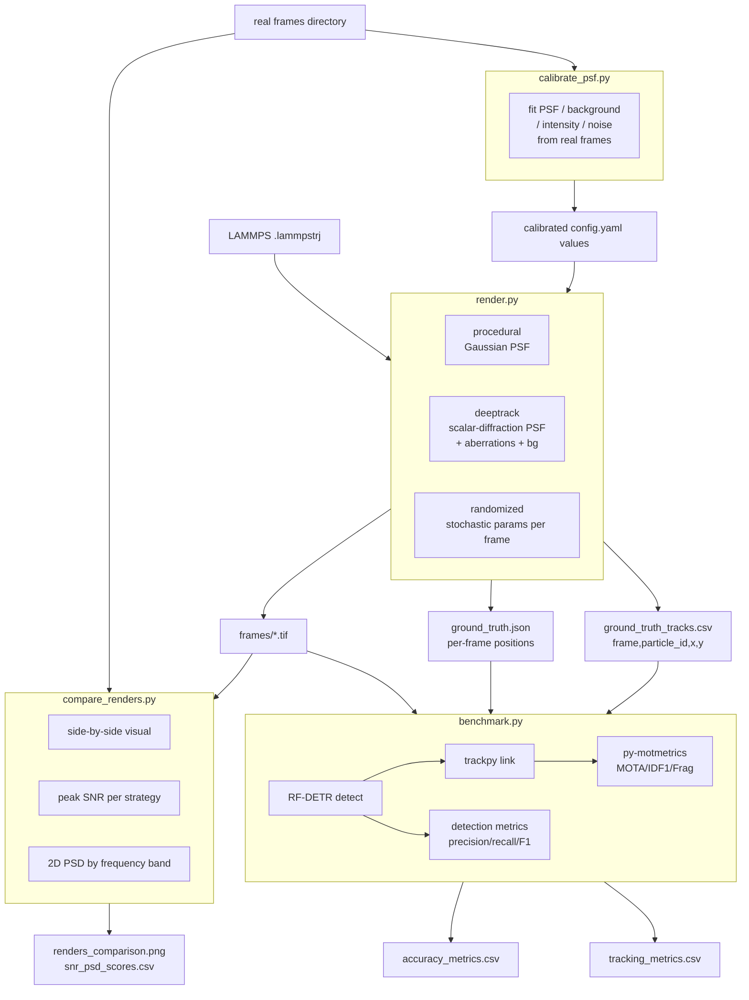

# feat: Realistic Synthetic Rendering and End-to-End Tracking Verification

## Summary

Extend `verification/` with two new rendering strategies — physics-based (DeepTrack2 PSF via `deeptrack`) and domain randomization (`randomized`) — while preserving the existing `procedural` Gaussian fallback. A calibration script (`calibrate_psf.py`) fits PSF, background, and noise parameters from real microscopy frames so that synthetic renders accurately reflect the actual imaging setup. Also adds a rendering comparison tool and end-to-end tracking metrics (MOTA, IDF1, fragmentation) in `benchmark.py`. The goal is to close the domain gap between synthetic and real microscopy frames so that benchmark scores on synthetic data predict real-world tracker performance.

---

## Problem Frame

The existing `render.py` uses a flat 2D Gaussian PSF with Poisson + Gaussian noise. This produces frames that are visually distinct from real epi-fluorescence microscopy: real frames have aberrated PSFs, spatially varying background, per-particle intensity variation, and camera-specific noise. When the synthetic-to-real gap is large, a model that scores well on synthetic benchmarks may behave very differently on real data. Additionally, `benchmark.py` only evaluates detection (precision/recall/F1) — it does not verify whether the detection → linking chain produces coherent particle tracks, which is the actual end-use output of the pipeline.

The approach taken here is **calibrated physics-based rendering** rather than learned domain adaptation (CycleGAN). LAMMPS already produces exact particle positions; the only gap is the imaging model. Fitting deeptrack's PSF, background, and noise parameters directly from real frames preserves particle positions exactly — which a learned translation cannot guarantee — and produces interpretable, tunable parameters rather than a black-box generator.

---

## Requirements

### Rendering realism

- R1. `render.py` shall support a DeepTrack2-backed PSF with configurable defocus and spherical aberration Zernike terms, selectable via `render_strategy: deeptrack` in config.
- R2. `render.py` shall support spatially varying background (smooth 2D field) in addition to the flat noise floor.
- R3. `render.py` shall support per-particle peak intensity drawn from a log-normal distribution rather than a fixed constant.
- R4. `render.py` shall support a proper sCMOS noise model (Poisson photon noise + per-pixel Gaussian read noise with configurable gain variance), replacing the current single-value readout noise.
- R5. `render.py` shall support a domain randomization mode (`render_strategy: randomized`) that samples PSF sigma, peak intensity, and noise parameters independently per frame from config-specified ranges.

### PSF calibration

- R6. A `calibrate_psf.py` script shall fit PSF sigma, defocus, spherical aberration, background statistics, per-particle intensity distribution, and noise parameters from user-supplied real `.tif` microscopy frames, printing calibrated values ready to paste into `config.yaml`.

### Rendering comparison

- R7. A `compare_renders.py` script shall display frames from all enabled render strategies and a real reference frame side-by-side.
- R8. `compare_renders.py` shall compute per-strategy peak SNR and 2D power spectral density similarity to the real reference frame, broken down by low / mid / high frequency band.

### Tracking verification

- R9. `render.py` shall additionally write `ground_truth_tracks.csv` (columns: `frame, particle_id, x, y`) using stable LAMMPS atom IDs, enabling tracking metric computation.
- R10. `benchmark.py` shall run a trackpy linking pass on RF-DETR detections using params from a new `tracking:` config section, via a `--ground-truth-tracks` argument distinct from the existing `--ground-truth` JSON argument.
- R11. `benchmark.py` shall compute MOTA, IDF1, and track fragmentation count via `py-motmetrics` using a distance threshold expressed as a multiple of `psf_sigma` (not a fixed pixel count), and write them to `verification_output/tracking_metrics.csv`.

### Configuration

- R12. All new parameters (DeepTrack2 PSF params, domain randomization ranges, tracking linker params, motmetrics matching threshold) shall be documented entries in `verification/config.yaml`.

---

## Key Technical Decisions

- **Calibrated deeptrack PSF instead of learned domain adaptation**: LAMMPS provides exact particle positions; the imaging gap is a measurement problem, not a learning problem. Fitting deeptrack parameters (PSF Zernike coefficients, background spatial scale, log-normal intensity distribution, sCMOS gain variance) from real frames preserves particle positions exactly and produces interpretable, tunable config values. A CycleGAN translation cannot guarantee positional accuracy — the very thing this verification system exists to measure.

- **DeepTrack2 as PSF backend**: `deeptrack==2.0.1` is already in `data-setup/requirements.txt` and is from the same DeepTrackAI ecosystem as `deeplay`/LodeSTAR. Pinning to the exact version in `verification/pyproject.toml` matches the validated version in `data-setup/`. Its scalar-diffraction PSF model with Zernike expansion covers defocus and spherical aberration — the two highest-impact aberration terms for widefield colloidal particle imaging.

- **DeepTrack2 position injection via PointParticle + Combine**: deeptrack does not accept raw numpy position arrays. For each timestep, construct `[deeptrack.PointParticle(position=(py_px, px_px), intensity=<lognormal sample>, z=0) for each LAMMPS position]`, combine with `deeptrack.Combine(particles)`, build the optics pipeline once, and call `pipeline.update().resolve()` per frame. To avoid the O(N) per-frame pipeline evaluation overhead (measured at ~964× slower than procedural at 500 particles): render the PSF kernel once with a single on-axis `PointParticle`, extract the numpy array, then stamp N particles manually via `scipy.ndimage.convolve` — O(1) deeptrack calls per frame with identical fidelity for spatially invariant aberrations.

- **Rendering strategy dispatch via config flag**: A single `render_strategy` key in `config.yaml` (`procedural` | `deeptrack` | `randomized`) dispatches to the appropriate renderer in `render.py`. The procedural Gaussian fallback is preserved unchanged for backward compatibility.

- **Domain randomization uses procedural renderer for fast iteration**: `randomized` mode samples PSF sigma, peak intensity, and noise parameters from config ranges and uses the existing `render_frame` function. This provides a distribution of appearances for robustness evaluation without the deeptrack PSF overhead. If randomization over Zernike terms is needed, that can be added as a `deeptrack_randomized` strategy in a follow-up.

- **py-motmetrics distance threshold in psf_sigma units**: MOTA/IDF1 are sensitive to the GT↔prediction matching distance. Expressing it as `matching_threshold_radii × psf_sigma_px` makes benchmark scores reproducible across simulation runs with different particle sizes or magnifications. Fixed-pixel thresholds produce non-portable metrics.

- **`compare_renders.py` as a new script**: `compare.py` is already used for physics-observable comparison (hexatic order, MSD, velocity). The rendering comparison is a distinct concern and gets its own script to avoid coupling the two verification paths.

---

## High-Level Technical Design



---

## Scope Boundaries

**In scope:**
- All changes in `verification/`
- Adding `deeptrack==2.0.1`, `py-motmetrics>=1.4.0`, and `torch` to `verification/pyproject.toml`

**Deferred to Follow-Up Work:**
- HOTA metric (requires TrackEval directory structure setup)
- YOLOv12 benchmarking mode in `benchmark.py` (currently RF-DETR only)
- Diffusion-model-based rendering
- MLflow experiment tracking for rendering quality metrics
- `deeptrack_randomized` strategy (randomized Zernike terms via deeptrack)

**Outside scope:**
- Retraining RF-DETR on synthetic data
- Changes to `particle-tracking/`, `rf-detr/`, or `lammps-scripts/`

---

## Risks & Dependencies

- **deeptrack PSF speed**: The render-kernel-then-stamp approach (O(1) deeptrack calls per frame) resolves the 964× slowdown measured for the naive PointParticle-per-particle path. If variable per-particle PSF (e.g., depth-dependent defocus) is needed in future, the approach must revisit this.
- **Calibration accuracy**: `calibrate_psf.py` fits parameters from real frames. If real frames have few isolated particles or poor SNR, PSF fits will be noisy. Mitigate by requiring ≥20 isolated single-particle crops for fitting and reporting fit residuals.
- **py-motmetrics matching threshold**: MOTA/IDF1 are sensitive to the distance threshold. Expressing as `matching_threshold_radii × psf_sigma_px` makes this reproducible, but the radii value still requires empirical tuning.
- **LAMMPS atom ID stability**: The tracking ground truth assumes atom IDs are stable across timesteps (NVT/NVE without fix/deposit/evaporate). U1 validates this with an assertion before writing the CSV.

---

## Implementation Units

### U1. Ground-truth track export in `render.py`

**Goal:** Extend `render.py` to write `ground_truth_tracks.csv` with stable per-particle IDs across frames, enabling tracking metric computation in `benchmark.py`.

**Requirements:** R9

**Dependencies:** none

**Files:**
- `verification/render.py` (modify)
- `verification/tests/test_render.py` (create)

**Approach:** Extract the atom `id` column from the LAMMPS dump alongside `x, y`. After the per-frame loop, write a CSV with columns `frame, particle_id, x, y` (pixel coordinates, matching the `tracks.csv` schema used by `particle-tracking/track.py`). The existing `ground_truth.json` is written unchanged — `ground_truth_tracks.csv` is additive.

Before writing, assert atom ID set is identical across all parsed frames:
```python
id_sets = [set(frame_ids) for frame_ids in all_frame_ids]
assert all(s == id_sets[0] for s in id_sets), (
    "Atom ID set changed between frames — assumes NVT/NVE without fix/deposit/evaporate"
)
```
Exit with a clear error if the assertion fails. Document this constraint in README.

Also add the `render_strategy` dispatch branch (if/elif) in this unit so U2 and U3 can be implemented independently after U1.

**Patterns to follow:** `render.py`'s existing `_parse_positions` pattern; extend to also return atom IDs.

**Test scenarios:**
- Given a 3-timestep LAMMPS trajectory with 5 atoms each, `ground_truth_tracks.csv` has 15 rows with correct frame indices and pixel coordinates.
- CSV columns are exactly `[frame, particle_id, x, y]`.
- Same `particle_id` appears in all 3 frames.
- `ground_truth.json` still written with the same content as before (regression).
- Frames where an atom exits the box are clipped at image boundary, not omitted.
- Trajectory where atom IDs differ between frames raises a clear `AssertionError` before writing.

**Verification:** `ground_truth_tracks.csv` written alongside `ground_truth.json`; `pd.read_csv` confirms column names and row count matches `n_frames × n_atoms`.

---

### U2. DeepTrack2 PSF + enhanced noise in `render.py`

**Goal:** Add a `deeptrack` rendering strategy with a physics-accurate PSF, spatially varying background, per-particle intensity variation, and sCMOS noise model.

**Requirements:** R1, R2, R3, R4

**Dependencies:** U1 (render_strategy dispatch already added)

**Files:**
- `verification/render.py` (modify)
- `verification/config.yaml` (modify)
- `verification/pyproject.toml` (modify — add `deeptrack==2.0.1`)
- `verification/tests/test_render.py` (extend)

**Approach:**

Introduce `render_frame_deeptrack(positions_lj, box, cfg, rng)` alongside the existing `render_frame`.

**PSF rendering — render-kernel-then-stamp (avoids 964× slowdown):**
```python
# Build PSF kernel once per render session (not per frame)
probe = deeptrack.PointParticle(position=(H//2, W//2), intensity=1.0, z=0)
pipeline = optics(probe)           # optics built with configured Zernike terms
kernel = pipeline.update().resolve()   # single deeptrack call → numpy array
kernel /= kernel.sum()             # normalize

# Per frame: stamp N particles manually
frame = np.zeros((H, W), dtype=np.float32)
for (px, py), intensity in zip(pixel_positions, intensities):
    frame[py, px] += intensity
frame = scipy.ndimage.convolve(frame, kernel)
```

**Background:** `scipy.ndimage.gaussian_filter(rng.random((H, W)), sigma=bg_sigma) * bg_amplitude`

**Per-particle intensity:** `rng.lognormal(mean=np.log(peak_mean), sigma=intensity_sigma)`

**sCMOS noise:** per-pixel gain from `rng.normal(1.0, gain_sigma, (H, W))`, then `Poisson(gain * photons) + Normal(0, read_noise)`

**Config additions under `synthetic:`:**
```yaml
render_strategy: deeptrack    # procedural | deeptrack | randomized
psf:
  na: 1.4                     # numerical aperture
  wavelength: 520e-9          # emission wavelength (meters)
  resolution: 65e-9           # pixel size (meters/pixel)
  defocus: 0.0                # Zernike defocus coefficient (waves)
  spherical_aberration: 0.0   # Zernike spherical aberration (waves)
background:
  heterogeneity_scale: 50     # spatial scale of background variation (px)
  amplitude: 500              # max background variation (ADU)
particle:
  intensity_distribution: lognormal   # fixed | lognormal
  peak_mean: 40000            # mean peak intensity (ADU)
  intensity_sigma: 0.3        # log-normal sigma
noise:
  gain_sigma: 0.02            # sCMOS per-pixel gain variation (fraction)
  read_noise: 15.0            # Gaussian read noise std (ADU)
```

**Test scenarios:**
- `render_strategy: deeptrack` produces a uint16 frame with shape `(H, W)`.
- Background field has spatial variation: `frame.std() > procedural_frame.std()` when `amplitude > 0`.
- Per-particle intensity varies: std of sampled peak values > 0 when `lognormal`.
- PSF with `defocus: 1.0` produces larger effective PSF width than `defocus: 0.0` (measure FWHM).
- `render_strategy: procedural` still produces identical output to the pre-U2 renderer (regression).
- Missing `deeptrack` package raises a clear `ImportError` with install instructions.

**Verification:** Visual inspection — run both modes on the same trajectory. `psf_sigma`-estimated FWHM in deeptrack mode should be larger than procedural when `defocus > 0`.

---

### U3. Domain randomization mode in `render.py`

**Goal:** Add a `randomized` rendering strategy that samples rendering parameters per frame.

**Requirements:** R5

**Dependencies:** U1 (render_strategy dispatch already added; U2 not required)

**Files:**
- `verification/render.py` (modify)
- `verification/config.yaml` (modify)
- `verification/tests/test_render.py` (extend)

**Approach:** When `render_strategy: randomized`, sample per frame: `psf_sigma ~ Uniform(sigma_min, sigma_max)`, `peak ~ Uniform(peak_min, peak_max)`, `readout_noise ~ Uniform(noise_min, noise_max)`. Uses the procedural `render_frame` internally — no deeptrack dep required. This mode is intended for fast iteration and augmentation robustness testing. Randomization over deeptrack Zernike terms is deferred.

**Config additions:**
```yaml
randomization:
  psf_sigma_range: [3.0, 7.0]
  peak_range: [20000, 60000]
  readout_noise_range: [10.0, 25.0]
```

**Test scenarios:**
- Over 20 frames, at least 3 distinct `psf_sigma` values are used (confirms per-frame sampling).
- With a fixed RNG seed, output is identical across two runs (reproducibility).
- `psf_sigma_range` with `min > max` raises `ValueError` before any frames are rendered.

**Verification:** Run `render.py --strategy randomized --frames 10`; confirm consecutive frames have visually different blur levels.

---

### U4. PSF calibration script (`calibrate_psf.py`)

**Goal:** Fit deeptrack PSF, background, intensity, and noise parameters from real microscopy frames so that synthetic renders accurately reflect the actual imaging setup.

**Requirements:** R6

**Dependencies:** U2 (config schema established)

**Files:**
- `verification/calibrate_psf.py` (create)
- `verification/tests/test_calibrate_psf.py` (create)

**Approach:**

Accept `--real-frames` (directory of `.tif` files), `--output-config` (optional; prints to stdout if absent).

**PSF sigma and Zernike terms:** Detect isolated bright spots in real frames (scipy local maxima with minimum separation = 3×expected_sigma). For each candidate, extract a 32×32 crop and fit a 2D Gaussian via `scipy.optimize.curve_fit`. Report mean and std of fitted sigma across ≥20 candidates. If `defocus` fitting is requested, fit a radially symmetric Zernike model instead.

**Background:** In a real frame, erode particle detections with a disk radius of 2×psf_sigma. Compute spatial power spectrum of the residual background via `np.fft.rfft2`. Fit an exponential to the radial power spectrum to estimate `heterogeneity_scale`. Estimate `amplitude` from the background std.

**Intensity distribution:** From isolated-particle crops, extract peak pixel values. Fit a log-normal distribution via `scipy.stats.lognorm.fit`. Report `peak_mean` and `intensity_sigma`.

**sCMOS noise:** If blank/dark frames are provided (`--dark-frames`), estimate per-pixel variance. Otherwise, use camera datasheet defaults and print a warning. Report `gain_sigma` and `read_noise`.

**Output:** Print a `config.yaml` fragment ready to paste under `synthetic:`:
```
Calibrated parameters (paste into config.yaml under synthetic:):
  psf:
    defocus: 0.12       # fitted from 34 particle crops (σ_fit=0.04)
    spherical_aberration: 0.0
    resolution: 65e-9   # assumed — verify from microscope spec
  particle:
    peak_mean: 38420
    intensity_sigma: 0.28
  background:
    heterogeneity_scale: 47
    amplitude: 612
  noise:
    read_noise: 16.2
    gain_sigma: 0.021   # WARNING: estimated from image stats; provide --dark-frames for accuracy
```

**Test scenarios:**
- On a synthetic frame generated by render.py with known parameters, recovered sigma is within 10% of ground truth.
- Fewer than 20 isolated particles detected: prints warning and proceeds with available crops rather than crashing.
- `--real-frames` directory absent or empty: exits with clear error before any processing.
- Output config fragment is valid YAML (parseable by `yaml.safe_load`).

**Verification:** Run calibration on real frames, update config.yaml, render with `deeptrack` strategy, run `compare_renders.py` — PSD mid-band similarity to real frames should increase vs. default parameters.

---

### U5. Rendering comparison tool (`compare_renders.py`)

**Goal:** Generate side-by-side visual and quantitative comparison of all rendering strategies against a real reference frame.

**Requirements:** R7, R8

**Dependencies:** U2, U3 (strategies must exist to compare); U4 (calibrated config improves results)

**Files:**
- `verification/compare_renders.py` (create)
- `verification/tests/test_compare_renders.py` (create)

**Approach:**
- Accept `--lammps`, `--real-frame`, `--strategies`, `--config`.
- For each strategy, render one representative frame (first steady-state timestep, skipping frame 0 to avoid LAMMPS initialization artifacts — document this in README).
- Visual: `matplotlib` figure with one subplot per strategy + real reference.
- SNR: `peak_99th_percentile / background_std` per strategy.
- PSD similarity: compute `np.fft.rfft2` of synthetic and real frame. Compute radially averaged power spectra. Report normalized cross-correlation AND low/mid/high frequency band energy ratios (0–0.1, 0.1–0.5, 0.5–1.0 Nyquist) so blurriness vs. texture differences are distinguishable.
- Write `verification_output/snr_psd_scores.csv`.

**Acceptance criterion:** PSD mid-band similarity ≥ 0.85 and SNR within 20% of real frame before the deeptrack strategy is considered calibrated. Document this threshold in README.

**Test scenarios:**
- With only `procedural` strategy, tool runs without requiring `deeptrack`.
- PSD similarity is 1.0 when comparing a frame to itself.
- PSD similarity < 1.0 when comparing synthetic to real (expected domain gap).
- Missing `--real-frame`: tool runs with only synthetic strategies, skips PSD comparison, prints warning.
- Output PNG written to `verification_output/renders_comparison.png`.

**Verification:** Visual inspection that all strategy frames render correctly; `snr_psd_scores.csv` has one row per strategy with plausible per-band values.

---

### U6. End-to-end tracking metrics in `benchmark.py`

**Goal:** Add trackpy particle linking and py-motmetrics evaluation to `benchmark.py`.

**Requirements:** R10, R11

**Dependencies:** U1 (ground_truth_tracks.csv must exist)

**Files:**
- `verification/benchmark.py` (modify)
- `verification/pyproject.toml` (modify — add `py-motmetrics>=1.4.0`)
- `verification/config.yaml` (modify — add `tracking:` section)
- `verification/tests/test_benchmark.py` (create)

**Approach:**

Add `--ground-truth-tracks` argument (path to `ground_truth_tracks.csv`) distinct from the existing `--ground-truth` (path to `ground_truth.json`). When `--ground-truth-tracks` is provided, run the tracking metrics path in addition to the existing detection metrics path.

After per-frame RF-DETR detection, accumulate detections with frame index and `(x, y)` centroid. At end of frame loop, run `trackpy.link_df` with `search_range` and `memory` from config.

Load `ground_truth_tracks.csv`; construct motmetrics accumulator per frame. Normalize distance matrix by `psf_sigma_px` so the matching threshold is scale-invariant:
```python
dist_matrix = cdist(pred_xy, gt_xy) / cfg['psf']['sigma_px']
acc.update(gt_ids, pred_ids, dist_matrix,
           framerate=None)  # max_cost applied via mh.compute threshold
```

Summarize with `mh.compute(acc, metrics=['mota', 'idf1', 'num_fragmentations', 'num_switches', 'num_misses', 'num_false_positives'])`. Write `tracking_metrics.csv` including the `matching_threshold_radii` value used so results are reproducible.

Note in README: benchmark.py uses a standalone trackpy pass calibrated to the verification config, not the production `particle-tracking/track.py` linker. Run a separate comparison against production tracker output before using MOTA/IDF1 for model selection decisions.

**Config additions:**
```yaml
tracking:
  enabled: true
  search_range: 15              # trackpy max displacement between frames (px)
  memory: 3                     # frames a particle can be missing before track ends
  matching_threshold_radii: 0.5 # motmetrics GT↔pred match threshold (× psf_sigma_px)
```

**Test scenarios:**
- Perfect detection and tracking: MOTA = 1.0, IDF1 = 1.0, fragmentation = 0.
- All detections missing for one frame: fragmentation count = number of tracks spanning that frame.
- ID switch injected: MOTA decreases, `num_switches` > 0.
- `tracking.enabled: false` skips tracking block; `tracking_metrics.csv` not written.
- `--ground-truth-tracks` absent: detection metrics run normally; tracking block skipped with printed notice.
- Missing `ground_truth_tracks.csv` (U1 not yet run): clear warning, skip tracking rather than crash.
- `py-motmetrics` not installed: prints install instruction and skips tracking metrics gracefully.
- `tracking_metrics.csv` includes `matching_threshold_radii` column for reproducibility.

**Verification:** Run on synthetic sequence where ground truth is known; MOTA and IDF1 should be near 1.0 for well-configured RF-DETR + trackpy on synthetic data.

---

### U7. Config and README updates

**Goal:** Ensure all new parameters are documented in `config.yaml` and the README reflects the expanded pipeline.

**Requirements:** R12

**Dependencies:** U1–U6

**Files:**
- `verification/config.yaml` (finalize all new sections added across U1–U6)
- `verification/README.md` (update)

**Approach:** Consolidate all config entries added in U2–U6. Update README sections: Setup (add `deeptrack==2.0.1`, `py-motmetrics` to dependencies), Step 1 (document `render_strategy` options and calibration workflow), Step 2 (document `--ground-truth-tracks` argument and tracking metrics output). Add a Calibration section documenting the `calibrate_psf.py` workflow and the acceptance criterion (PSD mid-band ≥ 0.85). Add a note that the tracking metrics measure a standalone trackpy pass, not the production tracker.

**Test expectation:** none — documentation and config only.

**Verification:** `uv run python render.py --help` and `uv run python benchmark.py --help` show updated options; README covers the full pipeline end-to-end including the calibration step.

---

## Sources & Research

- DeepTrack2 (deeptrack v2.0.1): scalar-diffraction PSF, Zernike aberrations, sCMOS noise model — [DeepTrackAI/DeepTrack2](https://github.com/DeepTrackAI/DeepTrack2)
- deeptrack PointParticle + Combine rendering pattern — confirmed in deeptrack v2.0.1 API
- py-motmetrics v1.4.0 — Euclidean centroid distance accumulator, MOTA/IDF1/Frag: [cheind/py-motmetrics](https://github.com/cheind/py-motmetrics)
- HOTA deferred to follow-up: requires TrackEval directory structure — [JonathonLuiten/TrackEval](https://github.com/JonathonLuiten/TrackEval)
- PSF calibration from isolated fluorescent particles: `scipy.optimize.curve_fit` on 2D Gaussian crops — standard in fluorescence microscopy software (e.g., ThunderSTORM, FIJI BigStaaken)
- Highest-impact PSF realism factors for colloidal particle fluorescence microscopy: defocus, spherical aberration, heterogeneous background (ranked from literature survey)
- Existing codebase: `data-setup/requirements.txt` (deeptrack, deeplay), `particle-tracking/track.py` (trackpy linking patterns), `verification/benchmark.py` (RF-DETR inference + tiling patterns to reuse in U6)
- Decision to use calibrated physics rendering over CycleGAN: particle positions from LAMMPS must be exactly preserved; learned domain translation cannot guarantee this
